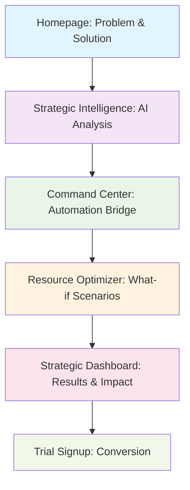

# PM33 Clickable Demo Workflow Map

> **Interactive Demo Architecture for Killer Narrative Experience**  
> **Version**: 1.0 | **Status**: Implementation Ready | **Updated**: 2025-08-18

## Table of Contents

- [Demo Flow Architecture](#demo-flow-architecture)
- [Page-by-Page Implementation Requirements](#page-by-page-implementation-requirements)
- [Interactive Elements & Animations](#interactive-elements--animations)
- [Data Flow & State Management](#data-flow--state-management)
- [Development Priorities](#development-priorities)

---

## Demo Flow Architecture

### Core Narrative Journey


### Demo Timing & Pacing
- **Total Demo Time**: 8-12 minutes for complete narrative
- **Page Transitions**: 1.5-2.5 minutes per strategic workflow
- **Interactive Pauses**: 30-60 seconds for user engagement
- **Conversion Points**: Multiple CTAs throughout journey

---

## Page-by-Page Implementation Requirements

### Page 1: Homepage (`/`) ✅ IMPLEMENTED
**Narrative Purpose**: Problem identification and solution positioning
**Demo Duration**: 2 minutes
**User Journey**: Hook → Pain Points → Solution Overview → Demo CTA

#### Current Implementation Status
```typescript
// ✅ Completed Elements
- Mantine UI conversion with professional design
- PM33 branding and logo integration
- Strategic intelligence value proposition
- Problem/solution comparison cards
- Clear CTA buttons to demo workflows

// 🔄 Enhancement Needs for Demo
- Add animated pain point statistics
- Include customer testimonial carousel
- Add demo preview video/animation
- Optimize conversion button placement
```

#### Demo Script Integration
**Opening Hook**: *"The $300K strategic consultant is being replaced by $149/month AI agent"*
**Pain Point**: Visual comparison of manual vs automated strategic workflows
**Solution Tease**: *"Watch PM33 transform strategic decisions into revenue in real-time"*
**Demo CTA**: *"See Strategic Intelligence in Action"* → Navigate to `/strategic-intelligence`

---

### Page 2: Strategic Intelligence Engine (`/strategic-intelligence`) ✅ IMPLEMENTED
**Narrative Purpose**: Core AI capability demonstration
**Demo Duration**: 2.5 minutes
**User Journey**: Strategic Question → AI Analysis → Strategic Recommendation → Automation Bridge

#### Current Implementation Status
```typescript
// ✅ Completed Elements
- Strategic question input interface
- Multi-framework analysis visualization (ICE/RICE/Blue Ocean)
- Real-time progress indicators and processing states
- Strategic recommendation output with confidence scoring
- PM33 branding throughout interface

// 🔄 Demo Enhancement Requirements
- Add predefined demo scenarios with realistic data
- Implement 30-second realistic processing animation
- Add framework visualization with animated scoring
- Include competitive analysis data integration
- Add "Generate Automation Bridge" CTA button
```

#### Demo Scenario Implementation
```typescript
const demoScenarios = [
  {
    id: "competitive_response",
    title: "Competitor raised $50M and launched competing feature. How do we respond?",
    processing: {
      steps: [
        "Analyzing competitor funding patterns...",
        "Evaluating feature gap impact...",
        "Applying strategic frameworks...",
        "Calculating resource requirements...",
        "Generating strategic recommendation..."
      ]
    },
    result: {
      strategy: "Accelerated Differentiation Strategy", 
      confidence: 87,
      frameworks: {
        ice: 8.2,
        rice: 156,
        blueOcean: "Advanced Analytics Capabilities"
      },
      impact: "34% churn reduction, $2.3M revenue protection",
      resources: "3 engineers, 2 months",
      timeline: "12-18 month competitive advantage"
    }
  }
]
```

#### Interactive Demo Flow
1. **User clicks predefined scenario** → Trigger realistic AI processing
2. **30-second animated analysis** → Show framework applications 
3. **Strategic recommendation appears** → Confidence scores and supporting data
4. **CTA: "See Automation Bridge"** → Navigate to `/command-center`

---

### Page 3: Strategic Command Center (`/command-center`) ✅ IMPLEMENTED  
**Narrative Purpose**: Automation bridge demonstration
**Demo Duration**: 2 minutes
**User Journey**: Strategic Decision → Task Generation → Priority Reordering → Resource Allocation

#### Current Implementation Status
```typescript
// ✅ Completed Elements
- 4 AI team visualization (Data, Strategic, Workflow, Communication)
- Real-time health scoring and metrics dashboard
- Strategic workflow status tracking
- PM33 branding and professional design

// 🔄 Demo Enhancement Requirements  
- Add strategic decision → task generation animation
- Implement priority reordering with visual feedback
- Add resource allocation optimization display
- Include strategic context preservation indicators
- Add "Optimize Resources" CTA button
```

#### Automation Bridge Demo Features
```typescript
interface AutomationBridgeDemo {
  strategicInput: "Accelerated Differentiation Strategy";
  
  automatedOutputs: {
    tasksGenerated: [
      "Epic: Advanced Analytics Capability Development",
      "Story: Competitive analysis integration",  
      "Story: Advanced dashboard functionality",
      "Task: Market positioning documentation"
    ],
    
    priorityReordering: {
      moved: ["Analytics Epic to P0"],
      rationale: "Strategic competitive advantage priority"
    },
    
    resourceAllocation: {
      engineers: 3,
      timeline: "8 weeks",
      impact: "12-18 month competitive moat"
    }
  };
}
```

#### Interactive Demo Elements
1. **Strategic decision flows in** → Animated task generation
2. **Priority matrix reorders** → Visual priority changes with rationale  
3. **Resource allocation optimizes** → Team capacity and timeline updates
4. **CTA: "Model Scenarios"** → Navigate to `/resource-optimizer`

---

### Page 4: Resource Allocation Optimizer (`/resource-optimizer`) ❌ TO BE BUILT
**Narrative Purpose**: What-if scenario modeling and ROI optimization
**Demo Duration**: 2 minutes  
**User Journey**: Scenario Options → Interactive Modeling → ROI Predictions → Optimal Allocation

#### Required Implementation
```typescript
interface ResourceOptimizerPage {
  scenario: {
    question: "3 engineers OR $150K marketing budget?";
    context: "Series B SaaS, growth stage, limited resources";
  };
  
  interactiveElements: {
    scenarioSliders: {
      engineers: { min: 0, max: 5, current: 3 },
      marketing: { min: 0, max: 200000, current: 150000 },
      partnerships: { min: 0, max: 3, current: 0 }
    };
    
    realTimeROI: {
      engineering: { impact: "23% feature velocity", timeline: "4 months" },
      marketing: { impact: "31% user acquisition", timeline: "2 months" },
      hybrid: { impact: "41% combined growth", timeline: "3 months", confidence: 79 }
    };
  };
  
  visualizations: {
    scenarios: "Interactive scenario comparison chart",
    timeline: "Resource impact over time visualization", 
    roi: "ROI calculation with confidence intervals"
  };
}
```

#### Interactive Demo Flow
1. **Present resource allocation dilemma** → User sees strategic options
2. **Interactive scenario modeling** → Sliders for engineers, marketing, partnerships
3. **Real-time ROI calculations** → Impact predictions update dynamically
4. **Optimal recommendation** → AI suggests hybrid approach with rationale
5. **CTA: "View Strategic Impact"** → Navigate to `/strategic-dashboard`

---

### Page 5: Strategic Impact Dashboard (`/strategic-dashboard`) ❌ TO BE BUILT
**Narrative Purpose**: Results demonstration and competitive positioning
**Demo Duration**: 2 minutes
**User Journey**: Impact Metrics → Competitive Analysis → Strategic Authority → Conversion

#### Required Implementation
```typescript
interface StrategicDashboard {
  impactMetrics: {
    revenueProtection: "$2.3M over 18 months",
    churnReduction: "34% improvement", 
    competitiveAdvantage: "12-18 month moat",
    decisionSpeed: "30 seconds vs 3 weeks",
    costSavings: "$15K vs consultant analysis"
  };
  
  competitiveIntelligence: {
    positioning: "Accelerated differentiation successful",
    marketResponse: "Competitors cannot replicate quickly",
    strategicMoat: "Advanced analytics capabilities"
  };
  
  strategicAuthority: {
    networkGrowth: "400% LinkedIn following increase",
    thoughtLeadership: "Strategic AI authority positioning",
    careerImpact: "VP Product promotion pathway"
  };
  
  benchmarking: {
    decisionSpeed: "87th percentile among Series B",
    strategicOutcomes: "Top 10% performance tier", 
    resourceEfficiency: "79% optimization vs peers"
  };
}
```

#### Demo Impact Visualization
1. **Strategic impact metrics** → Revenue protection, churn reduction, competitive advantage
2. **Competitive positioning** → Market response and strategic moat analysis  
3. **Strategic authority building** → Professional network growth and thought leadership
4. **Cross-company benchmarking** → Performance vs anonymous peer data
5. **CTA: "Transform Your Strategic Decision-Making"** → Navigate to `/trial`

---

### Page 6: Trial Signup & Conversion (`/trial`) ❌ TO BE BUILT
**Narrative Purpose**: Demo conclusion and conversion optimization
**Demo Duration**: 1 minute
**User Journey**: Demo Summary → Value Recap → Trial Signup → Onboarding

#### Conversion Page Requirements
```typescript
interface TrialConversion {
  demoSummary: {
    timeSpent: "10 minutes strategic intelligence demo",
    valueDemonstrated: "$15K consultant analysis in 30 seconds",
    impactProjected: "$2.3M revenue protection opportunity"
  };
  
  conversionElements: {
    socialProof: "Join 2,500+ strategic PMs",
    riskMitigation: "14-day free trial, no credit card",
    urgency: "Strategic advantage waiting",
    guarantee: "Strategic superstar guarantee or full refund"
  };
  
  onboardingPreview: {
    step1: "Connect your strategic context",
    step2: "Import existing product data", 
    step3: "Generate first strategic analysis",
    timeline: "Strategic intelligence in 5 minutes"
  };
}
```

---

## Interactive Elements & Animations

### Strategic Processing Animations
```typescript
interface ProcessingAnimations {
  strategicAnalysis: {
    duration: "30 seconds realistic timing",
    steps: [
      "Analyzing competitive landscape... (6s)",
      "Applying strategic frameworks... (8s)", 
      "Calculating resource impact... (7s)",
      "Generating recommendations... (5s)",
      "Finalizing strategic plan... (4s)"
    ],
    visualElements: {
      progressBar: "Smooth progression with framework icons",
      dataVisualization: "Charts building in real-time",
      confidence: "Confidence score increasing dynamically"
    }
  };
  
  automationBridge: {
    taskGeneration: "Strategic decision → animated task creation",
    priorityReordering: "Visual priority matrix reorganization", 
    resourceAllocation: "Team capacity optimization animation"
  };
  
  scenarioModeling: {
    interactiveSliders: "Real-time ROI calculation updates",
    outcomeProjections: "Timeline visualization with impact predictions",
    optimalRecommendation: "AI suggestion highlighting with rationale"
  };
}
```

### Micro-Interactions & Feedback
1. **Hover States**: Enhanced feedback on all interactive elements
2. **Loading States**: Strategic processing with branded animations
3. **Success States**: Strategic recommendations with celebration micro-animations
4. **Transition States**: Smooth page transitions maintaining demo narrative flow
5. **Error States**: Graceful fallbacks maintaining demo continuity

---

## Data Flow & State Management

### Demo State Architecture
```typescript
interface DemoState {
  currentStep: number;
  strategicScenario: string;
  analysisResults: StrategicAnalysis;
  automationBridge: AutomatedOutputs;
  scenarioModeling: ResourceOptimization;
  impactResults: StrategicImpact;
  userJourney: DemoProgress;
}

// State persistence across demo pages
const demoContext = createContext<DemoState>();

// Demo progress tracking
interface DemoProgress {
  pagesVisited: string[];
  timeSpent: number;
  interactionsCompleted: string[];
  conversionReadiness: number; // 0-100 scoring
}
```

### Data Integration Points
1. **Strategic scenarios** → Realistic analysis outputs
2. **Framework calculations** → ICE/RICE scoring with confidence intervals
3. **Resource modeling** → ROI predictions with timeline projections
4. **Impact metrics** → Revenue/competitive advantage calculations
5. **Benchmarking data** → Anonymous peer comparison analytics

---

## Development Priorities

### Phase 1: Demo Foundation (Week 1) ✅ MOSTLY COMPLETE
- [x] Homepage Mantine UI conversion
- [x] Strategic Intelligence Engine core functionality
- [x] Command Center dashboard implementation
- [x] Basic navigation and routing
- [x] PM33 branding integration

### Phase 2: Resource Optimizer Implementation (Week 2)
- [ ] Build `/resource-optimizer` page with interactive scenario modeling
- [ ] Implement what-if scenario sliders and real-time ROI calculations  
- [ ] Add resource allocation optimization visualizations
- [ ] Create smooth transitions from Command Center
- [ ] Add "View Strategic Impact" CTA integration

### Phase 3: Strategic Dashboard Implementation (Week 3)
- [ ] Build `/strategic-dashboard` with impact metrics visualization
- [ ] Implement competitive intelligence and benchmarking displays
- [ ] Add strategic authority and career impact indicators
- [ ] Create demo conclusion and conversion optimization
- [ ] Add "Start Free Trial" CTA integration

### Phase 4: Demo Polish & Optimization (Week 4)
- [ ] Add realistic processing animations (30-second strategic analysis)
- [ ] Implement smooth page transitions and state persistence
- [ ] Add interactive micro-animations and feedback systems
- [ ] Optimize conversion flow and trial signup experience
- [ ] Add demo analytics and user journey tracking

### Phase 5: Investor Presentation Alignment
- [ ] Ensure demo matches investor presentation script exactly
- [ ] Add strategic impact metrics matching fundraising projections
- [ ] Include competitive differentiation messaging throughout
- [ ] Optimize for live demo presentation timing and flow
- [ ] Add backup demo scenarios for different investor interests

---

This clickable demo workflow map provides the complete technical and narrative architecture for building PM33's killer demo experience that transforms strategic decision-making into revenue growth through interactive, realistic demonstrations of AI-powered automation bridges.