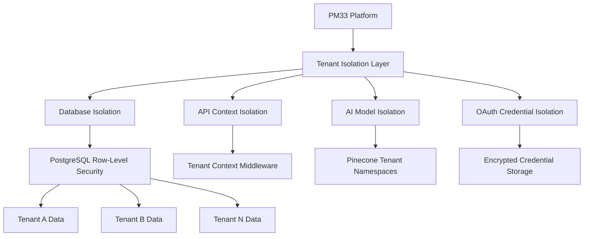
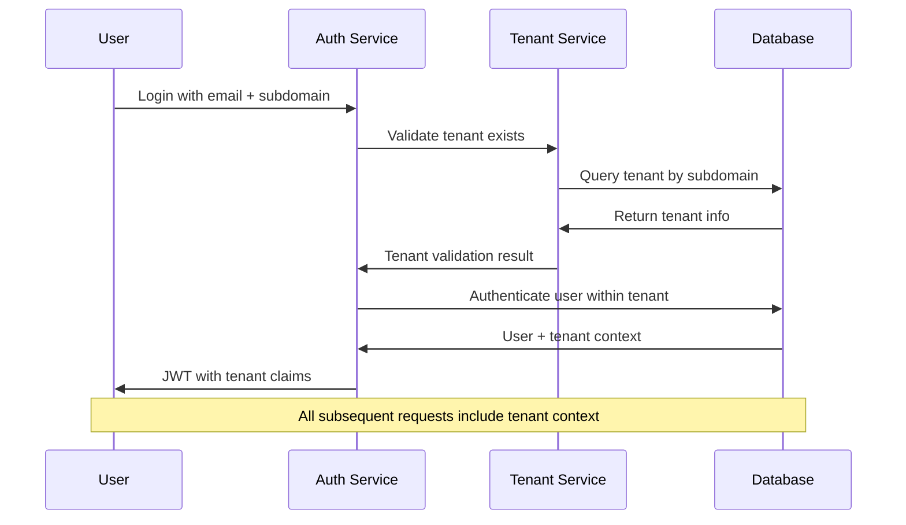
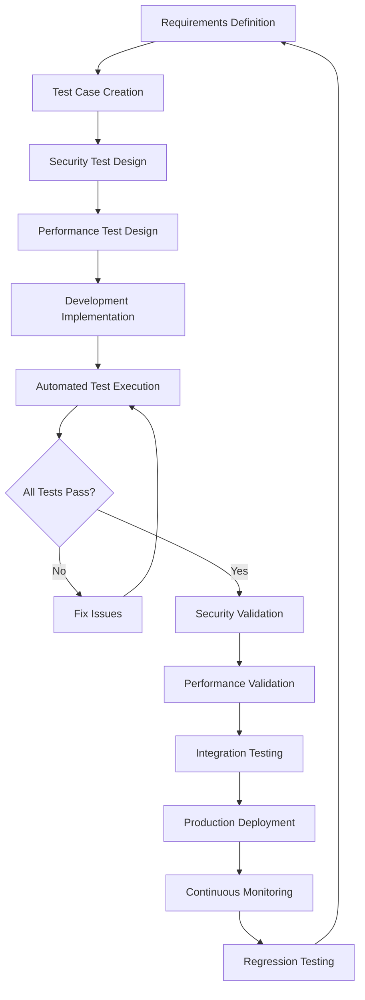

# PM33 Multi-Tenancy Architecture
*Enterprise-Grade B2B SaaS Multi-Tenancy Implementation Guide*

> **Version**: 1.0  
> **Last Updated**: January 2025  
> **Scope**: Complete multi-tenancy architecture for PM33 Strategic Intelligence Platform  
> **Target**: Support 1,000+ enterprise customers with secure tenant isolation

---

## 🎯 **Executive Summary**

This document defines the complete multi-tenancy architecture for PM33, transforming it from a single-user MVP to an enterprise-grade B2B SaaS platform. The architecture ensures complete tenant isolation, secure data handling, scalable billing, and proper OAuth integration while maintaining PM33's core strategic intelligence capabilities.

**Critical Business Requirements:**
- **Security**: Zero cross-tenant data leakage with enterprise-grade isolation
- **Compliance**: SOC 2, GDPR, and enterprise security requirements
- **Scalability**: Support growth from 50 beta users to 1,000+ enterprise customers
- **Revenue**: Enable Professional ($49), Enterprise ($99), Strategic ($199) pricing tiers

---

## 🏗️ **Multi-Tenancy Architecture Overview**

### **Core Tenancy Model**


### **Tenant Identification Strategy**
```
Tenant Routing Options:
1. Subdomain: tenant-name.pm33.ai (Recommended for branding)
2. Path-based: pm33.ai/tenant-name (Alternative for shared domains)
3. Header-based: X-Tenant-ID (For API-only access)

Selected Approach: Subdomain + Header fallback
- Production: {tenant}.pm33.ai
- Development: {tenant}.pm33.localhost:3000
- API: X-Tenant-ID header for programmatic access
```

---

## 🗄️ **Database Architecture & Row-Level Security**

### **PostgreSQL Multi-Tenancy Schema**

#### **Core Tenant Management Tables**
```sql
-- Primary tenant registration and configuration
CREATE TABLE tenants (
    id UUID PRIMARY KEY DEFAULT gen_random_uuid(),
    subdomain VARCHAR(50) UNIQUE NOT NULL,
    company_name VARCHAR(255) NOT NULL,
    subscription_tier VARCHAR(20) NOT NULL DEFAULT 'professional',
    subscription_status VARCHAR(20) NOT NULL DEFAULT 'trial',
    created_at TIMESTAMP WITH TIME ZONE DEFAULT NOW(),
    updated_at TIMESTAMP WITH TIME ZONE DEFAULT NOW(),
    settings JSONB DEFAULT '{}',
    
    -- Subscription and billing
    stripe_customer_id VARCHAR(255),
    stripe_subscription_id VARCHAR(255),
    billing_email VARCHAR(255),
    
    -- Enterprise features
    custom_domain VARCHAR(255),
    sso_enabled BOOLEAN DEFAULT FALSE,
    data_residency VARCHAR(50) DEFAULT 'us-east-1',
    
    -- Security and compliance
    encryption_key_id UUID,
    audit_retention_days INTEGER DEFAULT 365,
    
    CONSTRAINT valid_subdomain CHECK (subdomain ~ '^[a-z0-9]([a-z0-9-]*[a-z0-9])?$'),
    CONSTRAINT valid_subscription_tier CHECK (subscription_tier IN ('professional', 'enterprise', 'strategic')),
    CONSTRAINT valid_subscription_status CHECK (subscription_status IN ('trial', 'active', 'canceled', 'suspended'))
);

-- Tenant user management and roles
CREATE TABLE tenant_users (
    id UUID PRIMARY KEY DEFAULT gen_random_uuid(),
    tenant_id UUID NOT NULL REFERENCES tenants(id) ON DELETE CASCADE,
    email VARCHAR(255) NOT NULL,
    role VARCHAR(20) NOT NULL DEFAULT 'member',
    first_name VARCHAR(100),
    last_name VARCHAR(100),
    avatar_url TEXT,
    
    -- Authentication
    password_hash VARCHAR(255),
    email_verified BOOLEAN DEFAULT FALSE,
    last_login_at TIMESTAMP WITH TIME ZONE,
    
    -- Session management
    session_token VARCHAR(255),
    session_expires_at TIMESTAMP WITH TIME ZONE,
    
    -- Access control
    permissions JSONB DEFAULT '{}',
    created_at TIMESTAMP WITH TIME ZONE DEFAULT NOW(),
    updated_at TIMESTAMP WITH TIME ZONE DEFAULT NOW(),
    
    UNIQUE(tenant_id, email),
    CONSTRAINT valid_role CHECK (role IN ('admin', 'member', 'read_only')),
    
    -- Row-Level Security Policy
    FORCE ROW LEVEL SECURITY
);

-- Enable RLS and create policies
ALTER TABLE tenant_users ENABLE ROW LEVEL SECURITY;

CREATE POLICY tenant_isolation_policy ON tenant_users
    USING (tenant_id = current_setting('app.current_tenant_id')::UUID);
```

#### **Strategic Intelligence Data with Tenant Isolation**
```sql
-- Strategic conversations and context
CREATE TABLE strategic_conversations (
    id UUID PRIMARY KEY DEFAULT gen_random_uuid(),
    tenant_id UUID NOT NULL REFERENCES tenants(id) ON DELETE CASCADE,
    user_id UUID NOT NULL,
    
    -- Conversation content
    title VARCHAR(500),
    conversation_data JSONB NOT NULL,
    strategic_frameworks_used TEXT[],
    confidence_scores JSONB,
    
    -- Context and intelligence
    company_context_id UUID,
    competitive_context_id UUID,
    market_context_id UUID,
    
    -- Workflow integration
    jira_tasks_generated JSONB DEFAULT '[]',
    strategic_outcomes JSONB DEFAULT '{}',
    
    created_at TIMESTAMP WITH TIME ZONE DEFAULT NOW(),
    updated_at TIMESTAMP WITH TIME ZONE DEFAULT NOW(),
    
    -- Row-Level Security Policy
    FORCE ROW LEVEL SECURITY
);

ALTER TABLE strategic_conversations ENABLE ROW LEVEL SECURITY;

CREATE POLICY tenant_conversations_policy ON strategic_conversations
    USING (tenant_id = current_setting('app.current_tenant_id')::UUID);

-- Company context per tenant
CREATE TABLE company_contexts (
    id UUID PRIMARY KEY DEFAULT gen_random_uuid(),
    tenant_id UUID NOT NULL REFERENCES tenants(id) ON DELETE CASCADE,
    
    -- Company intelligence
    company_name VARCHAR(255),
    industry VARCHAR(100),
    stage VARCHAR(50),
    team_size INTEGER,
    revenue_stage VARCHAR(50),
    
    -- Strategic context
    mission_statement TEXT,
    strategic_objectives JSONB,
    current_okrs JSONB,
    competitive_landscape JSONB,
    
    -- Document intelligence
    extracted_documents JSONB DEFAULT '[]',
    website_analysis JSONB DEFAULT '{}',
    
    -- AI context embeddings (reference to Pinecone)
    embedding_namespace VARCHAR(100),
    context_summary TEXT,
    
    created_at TIMESTAMP WITH TIME ZONE DEFAULT NOW(),
    updated_at TIMESTAMP WITH TIME ZONE DEFAULT NOW(),
    
    -- Row-Level Security Policy
    FORCE ROW LEVEL SECURITY
);

ALTER TABLE company_contexts ENABLE ROW LEVEL SECURITY;

CREATE POLICY tenant_context_policy ON company_contexts
    USING (tenant_id = current_setting('app.current_tenant_id')::UUID);
```

#### **Integration Credentials with Encryption**
```sql
-- Secure OAuth and API credential storage per tenant
CREATE TABLE tenant_integrations (
    id UUID PRIMARY KEY DEFAULT gen_random_uuid(),
    tenant_id UUID NOT NULL REFERENCES tenants(id) ON DELETE CASCADE,
    
    -- Integration details
    integration_type VARCHAR(50) NOT NULL, -- 'jira', 'linear', 'slack', etc.
    integration_name VARCHAR(255) NOT NULL,
    
    -- OAuth credentials (encrypted)
    encrypted_credentials BYTEA NOT NULL,
    credential_expires_at TIMESTAMP WITH TIME ZONE,
    
    -- Integration configuration
    configuration JSONB DEFAULT '{}',
    field_mappings JSONB DEFAULT '{}',
    sync_settings JSONB DEFAULT '{}',
    
    -- Status and health
    status VARCHAR(20) DEFAULT 'active',
    last_sync_at TIMESTAMP WITH TIME ZONE,
    last_error TEXT,
    
    created_at TIMESTAMP WITH TIME ZONE DEFAULT NOW(),
    updated_at TIMESTAMP WITH TIME ZONE DEFAULT NOW(),
    
    UNIQUE(tenant_id, integration_type, integration_name),
    CONSTRAINT valid_integration_type CHECK (integration_type IN ('jira', 'linear', 'monday', 'asana', 'slack', 'teams', 'mixpanel', 'amplitude')),
    CONSTRAINT valid_status CHECK (status IN ('active', 'error', 'disabled')),
    
    -- Row-Level Security Policy
    FORCE ROW LEVEL SECURITY
);

ALTER TABLE tenant_integrations ENABLE ROW LEVEL SECURITY;

CREATE POLICY tenant_integrations_policy ON tenant_integrations
    USING (tenant_id = current_setting('app.current_tenant_id')::UUID);
```

### **Row-Level Security Implementation**

#### **Tenant Context Middleware**
```python
# FastAPI middleware for automatic tenant context
import uuid
from fastapi import Request, HTTPException
from sqlalchemy import text

class TenantContextMiddleware:
    def __init__(self, app):
        self.app = app
    
    async def __call__(self, scope, receive, send):
        if scope["type"] == "http":
            request = Request(scope, receive)
            
            # Extract tenant from subdomain or header
            tenant_id = await self.extract_tenant_context(request)
            
            if not tenant_id:
                raise HTTPException(status_code=400, detail="Tenant context required")
            
            # Set PostgreSQL session variable for RLS
            async with database.transaction():
                await database.execute(
                    text("SELECT set_config('app.current_tenant_id', :tenant_id, true)"),
                    {"tenant_id": str(tenant_id)}
                )
                
                # Continue with request processing
                await self.app(scope, receive, send)
        else:
            await self.app(scope, receive, send)
    
    async def extract_tenant_context(self, request: Request) -> uuid.UUID:
        # Priority 1: X-Tenant-ID header for API access
        if tenant_header := request.headers.get("X-Tenant-ID"):
            return uuid.UUID(tenant_header)
        
        # Priority 2: Subdomain extraction
        host = request.headers.get("host", "")
        if "." in host:
            subdomain = host.split(".")[0]
            tenant = await get_tenant_by_subdomain(subdomain)
            return tenant.id if tenant else None
        
        # Priority 3: Path-based (fallback)
        path_parts = request.url.path.strip("/").split("/")
        if path_parts[0] and path_parts[0] != "api":
            tenant = await get_tenant_by_subdomain(path_parts[0])
            return tenant.id if tenant else None
        
        return None
```

---

## 🔐 **Authentication & Authorization System**

### **Multi-Tenant Authentication Flow**


### **JWT Token Structure with Tenant Claims**
```json
{
  "sub": "user-uuid-here",
  "tenant_id": "tenant-uuid-here",
  "tenant_subdomain": "acme-corp",
  "role": "admin",
  "permissions": {
    "strategic_intelligence": ["read", "write"],
    "integrations": ["read", "write"],
    "billing": ["read"],
    "user_management": ["read", "write"]
  },
  "subscription_tier": "enterprise",
  "features": [
    "advanced_frameworks",
    "unlimited_integrations",
    "competitive_intelligence"
  ],
  "exp": 1704067200,
  "iat": 1703980800
}
```

### **Role-Based Access Control (RBAC)**
```python
# Tenant role definitions
TENANT_ROLES = {
    "admin": {
        "description": "Full tenant administration",
        "permissions": [
            "user_management.*",
            "billing.*", 
            "integrations.*",
            "strategic_intelligence.*",
            "settings.*"
        ]
    },
    "member": {
        "description": "Standard user access",
        "permissions": [
            "strategic_intelligence.read",
            "strategic_intelligence.write",
            "integrations.read",
            "settings.read"
        ]
    },
    "read_only": {
        "description": "View-only access",
        "permissions": [
            "strategic_intelligence.read",
            "integrations.read"
        ]
    }
}

# Feature access by subscription tier
SUBSCRIPTION_FEATURES = {
    "professional": [
        "basic_strategic_intelligence",
        "basic_integrations",
        "core_frameworks"
    ],
    "enterprise": [
        "advanced_strategic_intelligence",
        "unlimited_integrations", 
        "advanced_frameworks",
        "competitive_intelligence",
        "team_collaboration"
    ],
    "strategic": [
        "custom_ai_training",
        "advanced_analytics",
        "white_glove_support",
        "api_access",
        "custom_frameworks"
    ]
}
```

---

## 🤖 **AI Context Isolation Architecture**

### **Pinecone Tenant Namespace Strategy**
```python
# AI context isolation using Pinecone namespaces
class TenantAIContext:
    def __init__(self, tenant_id: str):
        self.tenant_id = tenant_id
        self.namespace = f"tenant_{tenant_id}"
        
    async def store_company_context(self, context_data: dict):
        """Store company intelligence with tenant isolation"""
        embeddings = await self.generate_embeddings(context_data)
        
        await pinecone_client.upsert(
            namespace=self.namespace,
            vectors=[{
                "id": f"company_context_{uuid4()}",
                "values": embeddings,
                "metadata": {
                    "tenant_id": self.tenant_id,
                    "type": "company_context",
                    "content": context_data
                }
            }]
        )
    
    async def query_strategic_intelligence(self, query: str) -> dict:
        """Query AI with tenant-scoped context only"""
        query_embedding = await self.generate_embeddings({"query": query})
        
        # Query only this tenant's namespace
        results = await pinecone_client.query(
            namespace=self.namespace,
            vector=query_embedding,
            top_k=5,
            include_metadata=True
        )
        
        # Ensure no cross-tenant contamination
        filtered_results = [
            result for result in results.matches
            if result.metadata.get("tenant_id") == self.tenant_id
        ]
        
        return await self.generate_strategic_response(query, filtered_results)
```

### **AI Model Tenant Isolation**
```python
# Strategic Intelligence with tenant context isolation
class TenantStrategicIntelligence:
    def __init__(self, tenant_context: TenantAIContext):
        self.tenant_context = tenant_context
        self.ai_engines = {
            "claude": AnthropicClient(),
            "openai": OpenAIClient(), 
            "together": TogetherClient()
        }
    
    async def analyze_strategic_question(
        self, 
        question: str,
        user_id: str
    ) -> dict:
        """Generate strategic intelligence with complete tenant isolation"""
        
        # 1. Retrieve ONLY tenant-specific context
        company_context = await self.tenant_context.get_company_context()
        competitive_context = await self.tenant_context.get_competitive_context()
        historical_decisions = await self.tenant_context.get_decision_history()
        
        # 2. Apply strategic frameworks with tenant-specific learning
        framework_recommendations = await self.select_frameworks(
            question, company_context
        )
        
        # 3. Generate response with tenant isolation guarantees
        strategic_analysis = await self.generate_analysis({
            "question": question,
            "company_context": company_context,
            "competitive_context": competitive_context,
            "historical_decisions": historical_decisions,
            "frameworks": framework_recommendations
        })
        
        # 4. Store interaction for tenant-specific learning
        await self.store_strategic_interaction({
            "tenant_id": self.tenant_context.tenant_id,
            "user_id": user_id,
            "question": question,
            "analysis": strategic_analysis,
            "frameworks_used": framework_recommendations
        })
        
        return strategic_analysis
    
    async def prevent_cross_tenant_contamination(self, response_data: dict):
        """Security layer to prevent accidental cross-tenant data leakage"""
        
        # Scan response for references to other tenant data
        tenant_references = await self.scan_for_tenant_references(response_data)
        
        if tenant_references:
            # Log security incident
            await self.log_security_incident({
                "type": "potential_cross_tenant_contamination",
                "tenant_id": self.tenant_context.tenant_id,
                "references_found": tenant_references,
                "response_sanitized": True
            })
            
            # Sanitize response
            response_data = await self.sanitize_cross_tenant_references(
                response_data, tenant_references
            )
        
        return response_data
```

---

## 🔗 **Jira OAuth Multi-Tenancy Integration**

### **OAuth Credential Management**
```python
# Secure OAuth credential storage and management per tenant
class TenantJiraIntegration:
    def __init__(self, tenant_id: str):
        self.tenant_id = tenant_id
        self.encryption_key = self.get_tenant_encryption_key()
    
    async def initiate_oauth_flow(self, callback_url: str) -> dict:
        """Start OAuth flow with tenant-specific callback"""
        oauth_config = {
            "client_id": JIRA_CLIENT_ID,
            "redirect_uri": f"{callback_url}?tenant={self.tenant_id}",
            "scope": "read:jira-work write:jira-work",
            "state": self.generate_oauth_state(),
            "audience": "api.atlassian.com",
            "response_type": "code"
        }
        
        # Store OAuth state with tenant context
        await self.store_oauth_state({
            "state": oauth_config["state"],
            "tenant_id": self.tenant_id,
            "expires_at": datetime.utcnow() + timedelta(minutes=10)
        })
        
        return oauth_config
    
    async def complete_oauth_flow(self, code: str, state: str) -> bool:
        """Complete OAuth with secure credential storage"""
        
        # Validate OAuth state belongs to this tenant
        if not await self.validate_oauth_state(state, self.tenant_id):
            raise SecurityException("Invalid OAuth state for tenant")
        
        # Exchange code for tokens
        token_response = await self.exchange_oauth_code(code)
        
        # Encrypt and store credentials with tenant isolation
        encrypted_credentials = self.encrypt_credentials({
            "access_token": token_response["access_token"],
            "refresh_token": token_response["refresh_token"],
            "expires_at": datetime.utcnow() + timedelta(
                seconds=token_response["expires_in"]
            ),
            "cloud_id": token_response["cloud_id"]
        })
        
        await self.store_integration_credentials({
            "tenant_id": self.tenant_id,
            "integration_type": "jira",
            "encrypted_credentials": encrypted_credentials,
            "configuration": {
                "cloud_id": token_response["cloud_id"],
                "scopes": token_response["scope"].split()
            }
        })
        
        return True
    
    async def make_authenticated_request(self, endpoint: str, method: str = "GET", data: dict = None):
        """Make Jira API request with tenant credential isolation"""
        
        # Retrieve and decrypt ONLY this tenant's credentials
        credentials = await self.get_decrypted_credentials("jira")
        
        if not credentials:
            raise IntegrationException("Jira integration not configured for tenant")
        
        # Verify token hasn't been compromised
        if not await self.verify_credential_integrity(credentials):
            raise SecurityException("Credential integrity check failed")
        
        # Make request with tenant-specific authentication
        headers = {
            "Authorization": f"Bearer {credentials['access_token']}",
            "Accept": "application/json",
            "Content-Type": "application/json"
        }
        
        url = f"https://api.atlassian.com/ex/jira/{credentials['cloud_id']}{endpoint}"
        
        response = await self.http_client.request(method, url, headers=headers, json=data)
        
        # Log API usage for tenant billing and monitoring
        await self.log_api_usage({
            "tenant_id": self.tenant_id,
            "integration": "jira",
            "endpoint": endpoint,
            "method": method,
            "response_status": response.status_code,
            "timestamp": datetime.utcnow()
        })
        
        return response.json()
```

### **Multi-Instance Jira Support**
```python
# Support multiple Jira instances per tenant (Enterprise feature)
class MultiInstanceJiraManager:
    def __init__(self, tenant_id: str):
        self.tenant_id = tenant_id
    
    async def add_jira_instance(self, instance_name: str, cloud_id: str, credentials: dict):
        """Add additional Jira instance for enterprise customers"""
        
        # Verify tenant has multi-instance feature
        tenant = await self.get_tenant(self.tenant_id)
        if tenant.subscription_tier not in ['enterprise', 'strategic']:
            raise FeatureNotAvailableException("Multi-instance Jira requires Enterprise tier")
        
        # Store with unique instance identifier
        await self.store_integration_credentials({
            "tenant_id": self.tenant_id,
            "integration_type": "jira",
            "integration_name": instance_name,
            "encrypted_credentials": self.encrypt_credentials(credentials),
            "configuration": {
                "cloud_id": cloud_id,
                "instance_type": "additional",
                "primary": False
            }
        })
    
    async def sync_across_instances(self, work_item_data: dict):
        """Sync work items across multiple Jira instances with tenant isolation"""
        
        instances = await self.get_tenant_jira_instances(self.tenant_id)
        sync_results = []
        
        for instance in instances:
            try:
                # Create work item in each instance with tenant context preserved
                result = await self.create_work_item(instance, {
                    **work_item_data,
                    "labels": [*work_item_data.get("labels", []), f"pm33-tenant-{self.tenant_id}"]
                })
                sync_results.append({"instance": instance.name, "success": True, "result": result})
            except Exception as e:
                sync_results.append({"instance": instance.name, "success": False, "error": str(e)})
        
        return sync_results
```

---

## 💰 **Billing & Subscription Management**

### **Stripe Multi-Tenant Integration**
```python
# Subscription management with tenant isolation and feature access
class TenantSubscriptionManager:
    def __init__(self):
        self.stripe_client = stripe
        
    async def create_tenant_subscription(
        self, 
        tenant_id: str,
        subscription_tier: str,
        payment_method_id: str,
        billing_email: str
    ) -> dict:
        """Create Stripe subscription with tenant-specific configuration"""
        
        # Create Stripe customer with tenant metadata
        customer = await self.stripe_client.Customer.create({
            "email": billing_email,
            "payment_method": payment_method_id,
            "metadata": {
                "tenant_id": tenant_id,
                "pm33_tier": subscription_tier
            }
        })
        
        # Get price ID for subscription tier
        price_id = self.get_price_id_for_tier(subscription_tier)
        
        # Create subscription with tenant context
        subscription = await self.stripe_client.Subscription.create({
            "customer": customer.id,
            "items": [{"price": price_id}],
            "metadata": {
                "tenant_id": tenant_id,
                "tier": subscription_tier
            }
        })
        
        # Update tenant with billing information
        await self.update_tenant_billing({
            "tenant_id": tenant_id,
            "stripe_customer_id": customer.id,
            "stripe_subscription_id": subscription.id,
            "subscription_tier": subscription_tier,
            "subscription_status": "active",
            "billing_email": billing_email
        })
        
        return {
            "customer_id": customer.id,
            "subscription_id": subscription.id,
            "status": subscription.status
        }
    
    def get_price_id_for_tier(self, tier: str) -> str:
        """Get Stripe price ID for subscription tier"""
        price_mapping = {
            "professional": "price_professional_monthly",
            "enterprise": "price_enterprise_monthly", 
            "strategic": "price_strategic_monthly"
        }
        return price_mapping.get(tier)
    
    async def handle_subscription_change(self, tenant_id: str, new_tier: str):
        """Handle subscription tier changes with feature access updates"""
        
        tenant = await self.get_tenant(tenant_id)
        
        # Update Stripe subscription
        subscription = await self.stripe_client.Subscription.modify(
            tenant.stripe_subscription_id,
            {
                "items": [{
                    "id": subscription.items.data[0].id,
                    "price": self.get_price_id_for_tier(new_tier)
                }],
                "proration_behavior": "create_prorations"
            }
        )
        
        # Update tenant tier and features
        await self.update_tenant({
            "tenant_id": tenant_id,
            "subscription_tier": new_tier
        })
        
        # Trigger feature access recalculation
        await self.recalculate_tenant_features(tenant_id, new_tier)
        
        return subscription
```

### **Usage-Based Billing Implementation**
```python
# Track usage metrics per tenant for billing
class TenantUsageTracker:
    def __init__(self, tenant_id: str):
        self.tenant_id = tenant_id
    
    async def track_api_usage(self, endpoint: str, tokens_used: int = 0):
        """Track API usage for billing calculations"""
        
        usage_record = {
            "tenant_id": self.tenant_id,
            "timestamp": datetime.utcnow(),
            "metric_type": "api_call",
            "endpoint": endpoint,
            "tokens_used": tokens_used,
            "billable": self.is_billable_endpoint(endpoint)
        }
        
        await self.store_usage_record(usage_record)
        
        # Check quotas and limits
        await self.check_usage_limits(self.tenant_id)
    
    async def track_ai_usage(self, engine: str, input_tokens: int, output_tokens: int, cost: float):
        """Track AI engine usage and costs"""
        
        usage_record = {
            "tenant_id": self.tenant_id,
            "timestamp": datetime.utcnow(),
            "metric_type": "ai_usage",
            "engine": engine,
            "input_tokens": input_tokens,
            "output_tokens": output_tokens,
            "estimated_cost": cost,
            "billable": True
        }
        
        await self.store_usage_record(usage_record)
    
    async def check_usage_limits(self, tenant_id: str):
        """Enforce usage limits based on subscription tier"""
        
        tenant = await self.get_tenant(tenant_id)
        limits = self.get_tier_limits(tenant.subscription_tier)
        current_usage = await self.get_monthly_usage(tenant_id)
        
        # Check API call limits
        if current_usage.api_calls >= limits.max_api_calls:
            await self.throttle_tenant_access(tenant_id, "api_limit_exceeded")
        
        # Check AI usage limits  
        if current_usage.ai_tokens >= limits.max_ai_tokens:
            await self.throttle_tenant_access(tenant_id, "ai_limit_exceeded")
        
        # Check storage limits
        if current_usage.storage_mb >= limits.max_storage_mb:
            await self.block_data_ingestion(tenant_id, "storage_limit_exceeded")
    
    def get_tier_limits(self, tier: str) -> dict:
        """Get usage limits for subscription tier"""
        limits = {
            "professional": {
                "max_api_calls": 10000,
                "max_ai_tokens": 100000,
                "max_storage_mb": 1000,
                "max_integrations": 3
            },
            "enterprise": {
                "max_api_calls": 50000,
                "max_ai_tokens": 500000,
                "max_storage_mb": 5000,
                "max_integrations": 999  # Unlimited
            },
            "strategic": {
                "max_api_calls": 200000,
                "max_ai_tokens": 2000000,
                "max_storage_mb": 20000,
                "max_integrations": 999  # Unlimited
            }
        }
        return limits.get(tier, limits["professional"])
```

---

## 🛡️ **Security & Compliance Architecture**

### **Data Encryption & Key Management**
```python
# Tenant-specific encryption and key management
class TenantEncryptionManager:
    def __init__(self, tenant_id: str):
        self.tenant_id = tenant_id
        self.kms_client = AWSKMSClient()
    
    async def get_tenant_encryption_key(self) -> str:
        """Get or create tenant-specific encryption key"""
        
        # Check for existing tenant key
        existing_key = await self.get_existing_key(self.tenant_id)
        if existing_key:
            return existing_key
        
        # Create new tenant-specific key
        key_response = await self.kms_client.create_key({
            "Description": f"PM33 tenant encryption key for {self.tenant_id}",
            "Usage": "ENCRYPT_DECRYPT",
            "KeySpec": "SYMMETRIC_DEFAULT",
            "Tags": [
                {"TagKey": "TenantId", "TagValue": self.tenant_id},
                {"TagKey": "Application", "TagValue": "PM33"},
                {"TagKey": "Environment", "TagValue": "production"}
            ]
        })
        
        # Store key reference with tenant
        await self.store_tenant_key_reference({
            "tenant_id": self.tenant_id,
            "kms_key_id": key_response["KeyMetadata"]["KeyId"],
            "created_at": datetime.utcnow()
        })
        
        return key_response["KeyMetadata"]["KeyId"]
    
    async def encrypt_tenant_data(self, data: dict) -> bytes:
        """Encrypt data using tenant-specific key"""
        
        key_id = await self.get_tenant_encryption_key()
        json_data = json.dumps(data, default=str)
        
        encrypted_response = await self.kms_client.encrypt({
            "KeyId": key_id,
            "Plaintext": json_data.encode(),
            "EncryptionContext": {
                "tenant_id": self.tenant_id,
                "application": "pm33"
            }
        })
        
        return encrypted_response["CiphertextBlob"]
    
    async def decrypt_tenant_data(self, encrypted_data: bytes) -> dict:
        """Decrypt data and verify tenant context"""
        
        decrypted_response = await self.kms_client.decrypt({
            "CiphertextBlob": encrypted_data,
            "EncryptionContext": {
                "tenant_id": self.tenant_id,
                "application": "pm33"
            }
        })
        
        json_data = decrypted_response["Plaintext"].decode()
        return json.loads(json_data)
```

### **Audit Logging & Compliance**
```python
# Comprehensive audit logging for tenant actions
class TenantAuditLogger:
    def __init__(self, tenant_id: str):
        self.tenant_id = tenant_id
    
    async def log_security_event(self, event_type: str, details: dict, user_id: str = None):
        """Log security events with tenant context"""
        
        audit_record = {
            "tenant_id": self.tenant_id,
            "user_id": user_id,
            "timestamp": datetime.utcnow().isoformat(),
            "event_type": event_type,
            "event_category": "security",
            "details": details,
            "ip_address": self.get_client_ip(),
            "user_agent": self.get_user_agent(),
            "severity": self.calculate_severity(event_type)
        }
        
        # Store in tenant-specific audit log
        await self.store_audit_record(audit_record)
        
        # Alert on high-severity events
        if audit_record["severity"] >= 8:
            await self.send_security_alert(audit_record)
    
    async def log_data_access(self, resource_type: str, resource_id: str, action: str, user_id: str):
        """Log data access for compliance tracking"""
        
        audit_record = {
            "tenant_id": self.tenant_id,
            "user_id": user_id,
            "timestamp": datetime.utcnow().isoformat(),
            "event_type": "data_access",
            "event_category": "compliance",
            "details": {
                "resource_type": resource_type,
                "resource_id": resource_id,
                "action": action,
                "success": True
            }
        }
        
        await self.store_audit_record(audit_record)
    
    async def generate_compliance_report(self, start_date: datetime, end_date: datetime) -> dict:
        """Generate compliance report for tenant"""
        
        audit_records = await self.get_audit_records({
            "tenant_id": self.tenant_id,
            "start_date": start_date,
            "end_date": end_date
        })
        
        return {
            "tenant_id": self.tenant_id,
            "report_period": {
                "start": start_date.isoformat(),
                "end": end_date.isoformat()
            },
            "summary": {
                "total_events": len(audit_records),
                "security_events": len([r for r in audit_records if r["event_category"] == "security"]),
                "data_access_events": len([r for r in audit_records if r["event_type"] == "data_access"]),
                "failed_logins": len([r for r in audit_records if r["event_type"] == "login_failed"]),
                "high_severity_events": len([r for r in audit_records if r.get("severity", 0) >= 8])
            },
            "events": audit_records
        }
```

---

## 📊 **Admin Interface & Management**

### **Tenant Administration Dashboard**
```python
# Administrative interface for tenant management
class TenantAdminInterface:
    def __init__(self, tenant_id: str, admin_user_id: str):
        self.tenant_id = tenant_id
        self.admin_user_id = admin_user_id
    
    async def get_tenant_dashboard_data(self) -> dict:
        """Comprehensive tenant dashboard with all management data"""
        
        # Verify admin permissions
        await self.verify_admin_access(self.admin_user_id, self.tenant_id)
        
        return {
            "tenant_info": await self.get_tenant_info(),
            "user_management": await self.get_user_management_data(),
            "billing_info": await self.get_billing_summary(),
            "integration_status": await self.get_integration_status(),
            "usage_analytics": await self.get_usage_analytics(),
            "security_summary": await self.get_security_summary()
        }
    
    async def manage_tenant_users(self, action: str, user_data: dict) -> dict:
        """Manage users within tenant"""
        
        if action == "invite_user":
            return await self.invite_user({
                "tenant_id": self.tenant_id,
                "email": user_data["email"],
                "role": user_data.get("role", "member"),
                "invited_by": self.admin_user_id
            })
        
        elif action == "update_user_role":
            return await self.update_user_role({
                "tenant_id": self.tenant_id,
                "user_id": user_data["user_id"],
                "new_role": user_data["role"],
                "updated_by": self.admin_user_id
            })
        
        elif action == "remove_user":
            return await self.remove_user({
                "tenant_id": self.tenant_id,
                "user_id": user_data["user_id"],
                "removed_by": self.admin_user_id
            })
    
    async def configure_integrations(self, integration_type: str, config_data: dict) -> dict:
        """Configure tenant integrations"""
        
        # Verify integration is available for subscription tier
        tenant = await self.get_tenant(self.tenant_id)
        available_integrations = self.get_tier_integrations(tenant.subscription_tier)
        
        if integration_type not in available_integrations:
            raise FeatureNotAvailableException(f"{integration_type} not available in {tenant.subscription_tier} tier")
        
        # Configure integration with tenant isolation
        return await self.setup_integration({
            "tenant_id": self.tenant_id,
            "integration_type": integration_type,
            "configuration": config_data,
            "configured_by": self.admin_user_id
        })
```

---

## 🧪 **Testing Agent Architecture**

### **Core Testing Agent Responsibilities**

PM33's multi-tenancy implementation requires rigorous testing to ensure zero cross-tenant data leakage and enterprise-grade security. The Testing Agent provides automated, comprehensive validation throughout the implementation process.

**Testing Agent Core Functions:**
- **Test Definition**: Create comprehensive test suites for each implementation phase
- **Automated Execution**: Run tests continuously during development with CI/CD integration
- **Validation Reporting**: Provide detailed pass/fail reports with actionable remediation items
- **Security Testing**: Specialized tenant isolation and security vulnerability assessment
- **Performance Testing**: Load testing, scalability validation, and performance benchmarking

### **Automated Testing Framework**

```python
class MultiTenancyTestingAgent:
    """Comprehensive testing agent for PM33 multi-tenancy implementation"""
    
    def __init__(self):
        self.test_suites = {
            "tenant_isolation": TenantIsolationTests(),
            "security": SecurityTests(), 
            "performance": PerformanceTests(),
            "integration": IntegrationTests(),
            "compliance": ComplianceTests(),
            "ai_isolation": AIContextIsolationTests(),
            "billing": BillingIntegrationTests()
        }
        self.success_criteria = {
            "security_tests_pass_rate": 100,  # Zero tolerance for security failures
            "code_coverage_minimum": 95,     # Comprehensive test coverage
            "performance_sla_compliance": 100, # All performance targets must be met
            "isolation_validation": 100       # Complete tenant isolation required
        }
    
    async def execute_phase_tests(self, phase: str, week: str) -> dict:
        """Execute all tests for a specific implementation phase/week"""
        results = {}
        
        for suite_name, test_suite in self.test_suites.items():
            try:
                results[suite_name] = await test_suite.run_phase_tests(phase, week)
            except Exception as e:
                results[suite_name] = {"status": "failed", "error": str(e)}
        
        return self.generate_comprehensive_report(results, phase, week)
    
    def generate_comprehensive_report(self, results: dict, phase: str, week: str) -> dict:
        """Generate comprehensive test report with actionable insights"""
        return {
            "phase": phase,
            "week": week,
            "timestamp": datetime.utcnow().isoformat(),
            "overall_status": self.calculate_overall_status(results),
            "security_score": self.calculate_security_score(results),
            "performance_metrics": self.extract_performance_metrics(results),
            "detailed_results": results,
            "actionable_items": self.identify_failures_and_recommendations(results),
            "compliance_status": self.validate_compliance_requirements(results),
            "production_readiness": self.assess_production_readiness(results)
        }
    
    async def validate_tenant_isolation(self) -> dict:
        """Critical test: Verify zero cross-tenant data leakage"""
        isolation_tests = [
            self.test_database_row_level_security(),
            self.test_api_context_isolation(),
            self.test_ai_model_separation(),
            self.test_oauth_credential_isolation(),
            self.test_billing_data_separation(),
            self.test_audit_log_isolation()
        ]
        
        results = await asyncio.gather(*isolation_tests, return_exceptions=True)
        
        # Zero tolerance for isolation failures
        all_passed = all(result.get("passed", False) for result in results if isinstance(result, dict))
        
        return {
            "isolation_validated": all_passed,
            "detailed_results": results,
            "critical_failures": [r for r in results if not r.get("passed", False)],
            "production_safe": all_passed
        }
```

### **Test Suite Specifications**

#### **Tenant Isolation Tests**
```python
class TenantIsolationTests:
    """Verify complete tenant data and context isolation"""
    
    async def test_database_row_level_security(self):
        """Verify PostgreSQL RLS prevents cross-tenant data access"""
        tenant_a = await self.create_test_tenant("isolation-test-a")
        tenant_b = await self.create_test_tenant("isolation-test-b")
        
        # Create strategic conversation in tenant A
        await self.create_strategic_data(tenant_a.id, {"content": "sensitive-tenant-a-data"})
        
        # Attempt to access from tenant B context
        with self.tenant_context(tenant_b.id):
            tenant_b_data = await self.query_strategic_conversations()
        
        # Critical: Tenant B must see zero data from tenant A
        assert len(tenant_b_data) == 0, "CRITICAL: Cross-tenant data leakage detected!"
        
        return {"passed": True, "message": "RLS isolation validated"}
    
    async def test_ai_context_contamination(self):
        """Verify AI models cannot access cross-tenant context"""
        tenant_a = await self.create_test_tenant("ai-test-a")
        tenant_b = await self.create_test_tenant("ai-test-b")
        
        # Store sensitive context in tenant A
        await self.store_tenant_ai_context(tenant_a.id, {
            "company_secrets": "tenant-a-proprietary-strategy",
            "competitive_intelligence": "confidential-market-analysis"
        })
        
        # Query AI from tenant B context
        with self.tenant_ai_context(tenant_b.id):
            ai_response = await self.query_strategic_intelligence(
                "What do you know about our competitive strategy?"
            )
        
        # Critical: AI response must not contain tenant A information
        assert "tenant-a-proprietary-strategy" not in ai_response.lower()
        assert "confidential-market-analysis" not in ai_response.lower()
        
        return {"passed": True, "message": "AI context isolation validated"}
```

#### **Security Validation Tests**
```python
class SecurityTests:
    """Comprehensive security and compliance validation"""
    
    async def test_oauth_credential_security(self):
        """Verify OAuth credentials are properly encrypted and isolated"""
        tenant_id = await self.create_test_tenant("oauth-security-test")
        
        # Store OAuth credentials
        test_credentials = {"access_token": "test-token-123", "refresh_token": "refresh-456"}
        await self.store_oauth_credentials(tenant_id, "jira", test_credentials)
        
        # Verify encryption at rest
        raw_db_data = await self.query_raw_credentials_table(tenant_id)
        assert "test-token-123" not in str(raw_db_data), "Credentials stored in plaintext!"
        
        # Verify decryption works correctly
        retrieved_credentials = await self.get_decrypted_credentials(tenant_id, "jira")
        assert retrieved_credentials["access_token"] == "test-token-123"
        
        return {"passed": True, "message": "OAuth credential security validated"}
    
    async def test_penetration_scenarios(self):
        """Automated penetration testing for common attack vectors"""
        scenarios = [
            self.test_sql_injection_resistance(),
            self.test_tenant_enumeration_protection(),
            self.test_session_hijacking_protection(),
            self.test_cross_tenant_privilege_escalation(),
            self.test_api_authentication_bypass_attempts()
        ]
        
        results = await asyncio.gather(*scenarios)
        all_secure = all(result.get("secure", False) for result in results)
        
        return {"passed": all_secure, "detailed_results": results}
```

#### **Performance & Scalability Tests**
```python
class PerformanceTests:
    """Load testing and performance validation"""
    
    async def test_concurrent_tenant_performance(self):
        """Test system performance with 1000+ concurrent tenants"""
        tenant_count = 1000
        tenants = await self.create_multiple_test_tenants(tenant_count)
        
        # Concurrent API requests from all tenants
        start_time = time.time()
        
        tasks = [
            self.make_authenticated_request(tenant.id, "/api/strategic/analyze", {
                "query": "Strategic analysis test"
            })
            for tenant in tenants
        ]
        
        results = await asyncio.gather(*tasks, return_exceptions=True)
        end_time = time.time()
        
        # Performance requirements
        avg_response_time = (end_time - start_time) / tenant_count
        success_rate = sum(1 for r in results if not isinstance(r, Exception)) / tenant_count
        
        performance_met = avg_response_time < 0.5 and success_rate > 0.95
        
        return {
            "passed": performance_met,
            "avg_response_time": avg_response_time,
            "success_rate": success_rate,
            "tenant_count": tenant_count
        }
    
    async def test_database_performance_with_rls(self):
        """Verify RLS doesn't significantly impact query performance"""
        tenant_id = await self.create_test_tenant("performance-test")
        
        # Create substantial test data
        await self.create_bulk_test_data(tenant_id, 10000)
        
        # Measure query performance with RLS
        start_time = time.time()
        with self.tenant_context(tenant_id):
            data = await self.query_strategic_conversations(limit=100)
        query_time = time.time() - start_time
        
        # Performance requirement: < 100ms for typical queries
        performance_acceptable = query_time < 0.1
        
        return {
            "passed": performance_acceptable,
            "query_time_ms": query_time * 1000,
            "record_count": len(data)
        }
```

---

## 🚀 **Implementation Roadmap**

### **Phase 1: Core Multi-Tenancy Foundation (Weeks 1-4)**

#### **Week 1: Database Schema & RLS + Testing**
**Development Tasks:**
- ✅ **Database Migration**: Create tenant tables with UUID primary keys
- ✅ **Row-Level Security**: Implement PostgreSQL RLS policies for all tables
- ✅ **Tenant Context Middleware**: FastAPI middleware for automatic tenant context
- ✅ **Basic Authentication**: JWT tokens with tenant claims

**Testing Agent Tasks:**
- 🧪 **Unit Tests**: Database schema validation and RLS policy enforcement tests
- 🧪 **Integration Tests**: Middleware tenant context isolation validation
- 🧪 **Security Tests**: JWT token validation and tenant claim verification
- 🧪 **Performance Tests**: Database query performance benchmarks with RLS enabled
- 🧪 **Automated Test Suite**: Achieve 95% code coverage requirement
- 📊 **Test Report**: Database isolation and authentication security validation

#### **Week 2: Basic Tenant Management + Testing**
**Development Tasks:**
- ✅ **Tenant Registration**: Subdomain-based tenant creation
- ✅ **User Management**: Role-based access within tenants
- ✅ **Session Management**: Tenant-aware session handling
- ✅ **Basic Admin Interface**: Tenant dashboard foundation

**Testing Agent Tasks:**
- 🧪 **Functional Tests**: Tenant registration workflow end-to-end validation
- 🧪 **Authorization Tests**: RBAC enforcement across tenant boundaries
- 🧪 **Session Tests**: Tenant session isolation and proper expiration
- 🧪 **UI Tests**: Admin interface functionality validation via Playwright
- 🧪 **Edge Case Tests**: Invalid tenant scenarios, malformed requests, boundary conditions
- 📊 **Test Report**: Tenant management security and functionality validation

#### **Week 3: Core Jira Integration + Testing**
**Development Tasks:**
- ✅ **OAuth Flow**: Tenant-specific Jira OAuth implementation
- ✅ **Credential Storage**: Encrypted credential storage per tenant
- ✅ **API Integration**: Tenant-isolated Jira API calls
- ✅ **Basic Sync**: Work item sync with tenant context preservation

**Testing Agent Tasks:**
- 🧪 **OAuth Tests**: Complete OAuth flow validation per tenant
- 🧪 **Encryption Tests**: Credential encryption/decryption security validation
- 🧪 **API Tests**: Jira integration with strict tenant isolation verification
- 🧪 **Sync Tests**: Work item sync accuracy and tenant data separation
- 🧪 **Security Tests**: OAuth credential cross-tenant isolation validation
- 📊 **Test Report**: Jira integration security and isolation compliance

#### **Week 4: Security & Compliance + Testing**
**Development Tasks:**
- ✅ **Encryption**: Tenant-specific data encryption
- ✅ **Audit Logging**: Comprehensive audit trail per tenant
- ✅ **Security Testing**: Penetration testing for tenant isolation
- ✅ **Compliance Review**: SOC 2 readiness assessment

**Testing Agent Tasks:**
- 🧪 **Penetration Tests**: Automated security vulnerability scanning and attack simulation
- 🧪 **Audit Tests**: Audit log completeness and tenant isolation verification
- 🧪 **Compliance Tests**: SOC 2 control validation and documentation
- 🧪 **Encryption Tests**: Data encryption at rest and in transit validation
- 🧪 **Security Report**: Comprehensive security assessment with zero-tolerance for failures
- 📊 **Phase 1 Validation**: Complete tenant isolation confirmation for production readiness

### **Phase 2: Advanced Features (Weeks 5-8)**

#### **Week 5: AI Context Isolation + Testing**
**Development Tasks:**
- 🔄 **Pinecone Namespaces**: Tenant-isolated vector storage
- 🔄 **AI Model Separation**: Prevent cross-tenant AI contamination
- 🔄 **Strategic Context**: Company intelligence per tenant
- 🔄 **Learning Isolation**: Tenant-specific AI improvement

**Testing Agent Tasks:**
- 🧪 **AI Isolation Tests**: Verify zero cross-tenant AI contamination with sensitive data injection
- 🧪 **Vector Storage Tests**: Pinecone namespace isolation validation
- 🧪 **Context Tests**: Company intelligence tenant separation verification
- 🧪 **Learning Tests**: AI model improvement isolation per tenant validation
- 🧪 **Performance Tests**: AI response time with tenant isolation overhead measurement
- 📊 **Test Report**: AI context isolation and strategic intelligence security validation

#### **Week 6: Billing Integration + Testing**
**Development Tasks:**
- 🔄 **Stripe Integration**: Multi-tenant subscription management
- 🔄 **Usage Tracking**: API and AI usage monitoring per tenant
- 🔄 **Feature Gating**: Subscription tier-based feature access
- 🔄 **Invoice Management**: Tenant-specific billing

**Testing Agent Tasks:**
- 🧪 **Billing Tests**: Stripe subscription management accuracy validation
- 🧪 **Usage Tests**: Accurate usage tracking per tenant verification
- 🧪 **Feature Tests**: Subscription tier access control enforcement validation
- 🧪 **Invoice Tests**: Billing accuracy and tenant data isolation verification
- 🧪 **Payment Tests**: Payment processing security and tenant isolation validation
- 📊 **Test Report**: Billing system security, accuracy, and compliance validation

#### **Week 7: Advanced Admin Features + Testing**
**Development Tasks:**
- 🔄 **User Invitation System**: Team member management
- 🔄 **Integration Management**: OAuth connection management
- 🔄 **Usage Analytics**: Tenant usage dashboards
- 🔄 **Support Interface**: Tenant-scoped customer support

**Testing Agent Tasks:**
- 🧪 **Admin Tests**: User invitation and management workflow validation
- 🧪 **Integration Tests**: OAuth connection management security validation
- 🧪 **Analytics Tests**: Tenant usage dashboard data accuracy and isolation
- 🧪 **Support Tests**: Customer support interface tenant scoping validation
- 🧪 **Permission Tests**: Admin privilege boundaries and tenant isolation verification
- 📊 **Test Report**: Admin interface security and tenant management validation

#### **Week 8: Enterprise Features + Testing**
**Development Tasks:**
- 🔄 **Multi-Instance Support**: Multiple Jira instances per tenant
- 🔄 **Custom Domains**: Enterprise custom domain support
- 🔄 **Advanced Security**: Enhanced compliance features
- 🔄 **API Access**: Tenant-specific API endpoints

**Testing Agent Tasks:**
- 🧪 **Multi-Instance Tests**: Multiple Jira instance isolation and management validation
- 🧪 **Domain Tests**: Custom domain security and routing validation
- 🧪 **Security Tests**: Enhanced compliance feature validation
- 🧪 **API Tests**: Tenant-specific API endpoint security and isolation validation
- 🧪 **Enterprise Tests**: Enterprise feature set comprehensive validation
- 📊 **Phase 2 Validation**: Advanced features security and isolation confirmation

### **Phase 3: Scale & Optimization (Weeks 9-12)**

#### **Week 9: Performance Optimization + Testing**
**Development Tasks:**
- ⏳ **Database Optimization**: Query optimization and indexing
- ⏳ **Caching Strategy**: Tenant-aware caching implementation
- ⏳ **API Rate Limiting**: Tenant-specific rate limiting
- ⏳ **Load Testing**: Multi-tenant performance testing

**Testing Agent Tasks:**
- 🧪 **Performance Tests**: Database query optimization validation with 1000+ tenants
- 🧪 **Caching Tests**: Tenant-aware cache isolation and performance validation
- 🧪 **Rate Limit Tests**: Tenant-specific rate limiting enforcement validation
- 🧪 **Load Tests**: System performance under high concurrent tenant load
- 🧪 **Scalability Tests**: Performance degradation analysis with tenant growth
- 📊 **Test Report**: Performance optimization effectiveness and scalability validation

#### **Week 10: Monitoring & Alerting + Testing**
**Development Tasks:**
- ⏳ **Health Monitoring**: Tenant-specific health metrics
- ⏳ **Security Monitoring**: Automated threat detection
- ⏳ **Usage Alerts**: Quota and limit alerting
- ⏳ **Performance Monitoring**: Response time tracking per tenant

**Testing Agent Tasks:**
- 🧪 **Monitoring Tests**: Tenant-specific health metrics accuracy validation
- 🧪 **Security Tests**: Automated threat detection effectiveness validation
- 🧪 **Alert Tests**: Quota and limit alerting accuracy and tenant isolation
- 🧪 **Performance Tests**: Response time tracking accuracy per tenant
- 🧪 **Anomaly Tests**: Security and performance anomaly detection validation
- 📊 **Test Report**: Monitoring system effectiveness and tenant isolation validation

#### **Week 11: Data Migration & Backup + Testing**
**Development Tasks:**
- ⏳ **Migration Tools**: Single-tenant to multi-tenant migration
- ⏳ **Backup Strategy**: Tenant-isolated backup and recovery
- ⏳ **Disaster Recovery**: Multi-tenant disaster recovery procedures
- ⏳ **Data Export**: GDPR-compliant data export per tenant

**Testing Agent Tasks:**
- 🧪 **Migration Tests**: Data migration accuracy and tenant isolation preservation
- 🧪 **Backup Tests**: Tenant-isolated backup integrity and recovery validation
- 🧪 **Recovery Tests**: Disaster recovery procedures effectiveness validation
- 🧪 **Export Tests**: GDPR-compliant data export accuracy and tenant isolation
- 🧪 **Data Integrity Tests**: Post-migration data consistency and isolation validation
- 📊 **Test Report**: Data operations security and tenant isolation validation

#### **Week 12: Final Testing & Documentation + Validation**
**Development Tasks:**
- ⏳ **Security Audit**: Third-party security assessment
- ⏳ **Penetration Testing**: Multi-tenant security validation
- ⏳ **Documentation**: Complete multi-tenancy documentation
- ⏳ **Production Deployment**: Multi-tenant production rollout

**Testing Agent Tasks:**
- 🧪 **Comprehensive Security Audit**: Third-party security assessment coordination
- 🧪 **Penetration Testing**: Multi-tenant security validation with professional tools
- 🧪 **Documentation Tests**: Documentation accuracy and completeness validation
- 🧪 **Production Readiness Tests**: Full system validation for production deployment
- 🧪 **Final Validation**: Zero-tolerance security and isolation confirmation
- 📊 **Production Readiness Report**: Complete system validation for enterprise deployment

### **Phase 4: Enterprise & Scale Features (Weeks 13-16)**

#### **Week 13: SSO & Enterprise Auth**
- ⏳ **SAML Integration**: Enterprise SSO support
- ⏳ **OIDC Support**: Modern authentication protocols
- ⏳ **Directory Sync**: Active Directory integration
- ⏳ **MFA Enforcement**: Multi-factor authentication

#### **Week 14: Advanced Integrations**
- ⏳ **Slack Enterprise**: Enterprise Slack integration
- ⏳ **Teams Integration**: Microsoft Teams support
- ⏳ **Custom Webhooks**: Tenant-specific webhook endpoints
- ⏳ **API Management**: Advanced API access controls

#### **Week 15: Multi-Region Deployment**
- ⏳ **Data Residency**: Regional data storage options
- ⏳ **Global Load Balancing**: Multi-region traffic routing
- ⏳ **Regional Failover**: Disaster recovery across regions
- ⏳ **Compliance Zones**: Region-specific compliance features

#### **Week 16: Advanced Analytics & Insights**
- ⏳ **Tenant Analytics**: Advanced usage analytics per tenant
- ⏳ **Predictive Insights**: Usage prediction and optimization
- ⏳ **Custom Dashboards**: Tenant-specific dashboard customization
- ⏳ **Advanced Reporting**: Enterprise-grade reporting features

---

## 🎯 **Testing Agent Success Metrics & Validation Criteria**

### **Critical Security & Isolation Validation**
**Zero-Tolerance Requirements:**
- ✅ **100% Cross-Tenant Isolation**: Zero data leakage tolerance - single failure blocks production
- ✅ **100% Authentication Security**: All tenant access authenticated and authorized - no exceptions
- ✅ **100% Credential Protection**: OAuth credentials encrypted with tenant-specific keys - verified at rest and in transit
- ✅ **100% Audit Compliance**: Complete audit trail for all tenant actions - SOC 2 compliance verified

**Testing Agent Validation Criteria:**
- 🧪 **Security Test Pass Rate**: 100% - No security test failures acceptable
- 🧪 **Penetration Test Score**: 95%+ - Professional security assessment validation
- 🧪 **Isolation Test Coverage**: 100% - Every tenant boundary tested and validated
- 🧪 **Vulnerability Scan**: 0 critical, 0 high-severity vulnerabilities acceptable

### **Performance & Scalability Validation**
**Performance Requirements:**
- 🎯 **Query Performance**: < 100ms average for tenant-filtered database queries (validated under load)
- 🎯 **API Response Time**: < 500ms average for tenant-specific API calls (99th percentile)
- 🎯 **Concurrent Tenants**: Support 1,000+ concurrent tenants without degradation (load tested)
- 🎯 **Data Isolation Overhead**: < 5% performance penalty for tenant isolation

**Testing Agent Performance Criteria:**
- 🧪 **Load Test Success**: 95%+ success rate under 1000 concurrent tenant load
- 🧪 **Performance Regression**: 0% - No performance degradation with tenant isolation
- 🧪 **Scalability Validation**: Linear performance scaling up to 10,000 tenants
- 🧪 **Resource Utilization**: < 80% CPU/memory under normal load

### **Functional & Integration Validation**
**Business Logic Requirements:**
- 💰 **Billing Accuracy**: 100% - Revenue recognition and usage tracking validated
- 📊 **Feature Access Control**: 100% - Subscription tier enforcement validated
- 🎫 **Admin Interface Security**: 100% - Tenant-scoped administration validated
- 📈 **Data Integrity**: 100% - Cross-tenant data consistency validated

**Testing Agent Integration Criteria:**
- 🧪 **API Integration Tests**: 95%+ success rate for all external integrations
- 🧪 **Workflow Validation**: 100% - All user workflows tested end-to-end
- 🧪 **Error Handling**: 95%+ - Graceful degradation under failure conditions
- 🧪 **Data Migration**: 100% - Zero data loss during tenant migration

### **Compliance & Documentation Validation**
**Regulatory Requirements:**
- 🔒 **SOC 2 Compliance**: 100% control validation and documentation
- 🔒 **GDPR Compliance**: 100% data protection and export capability validation
- 🔒 **Enterprise Security**: 100% enterprise security requirement compliance
- 🔒 **Audit Trail**: 100% - Complete tenant action auditability

**Testing Agent Documentation Criteria:**
- 📚 **Test Coverage Documentation**: 95%+ code coverage with test documentation
- 📚 **Security Test Documentation**: 100% security test procedures documented
- 📚 **Incident Response**: 100% security incident response procedures tested
- 📚 **Recovery Procedures**: 100% disaster recovery procedures validated

### **Continuous Testing Success Metrics**

#### **Weekly Testing KPIs**
```
Testing Agent Weekly Success Criteria:
├── Security Tests: 100% pass rate (zero failures tolerated)
├── Performance Tests: 95%+ SLA compliance
├── Integration Tests: 95%+ success rate
├── Code Coverage: 95%+ with meaningful tests
├── Documentation: 100% test procedure documentation
└── Regression Prevention: 0 new security vulnerabilities
```

#### **Phase Completion Criteria**
```
Phase Gate Requirements (All must pass for phase completion):
├── Security Validation: 100% isolation validation + penetration test pass
├── Performance Validation: All performance targets met under load
├── Integration Validation: All external integrations tested and validated
├── Compliance Validation: SOC 2 + GDPR requirements fully satisfied
├── Documentation Validation: Complete test documentation and procedures
└── Production Readiness: Third-party security audit and validation
```

### **Testing Agent Automated Reporting**

#### **Daily Automated Reports**
- **Security Status**: Real-time security test results and vulnerability tracking
- **Performance Metrics**: Response times, throughput, and resource utilization
- **Integration Health**: External API connectivity and success rates
- **Coverage Analysis**: Code coverage trends and gap identification
- **Regression Tracking**: New issues introduced and resolution status

#### **Weekly Comprehensive Reports**
- **Security Assessment**: Comprehensive security posture with threat analysis
- **Performance Benchmarking**: Performance trends and scalability projections
- **Quality Metrics**: Test quality, effectiveness, and improvement recommendations
- **Compliance Status**: Regulatory compliance validation and gap analysis
- **Production Readiness**: Go/no-go assessment with risk analysis

### **Technical Implementation Validation**

#### **Data Isolation Testing**
```python
# Automated tests for tenant isolation
async def test_tenant_data_isolation():
    """Verify complete tenant data isolation"""
    
    # Create test tenants
    tenant_a = await create_test_tenant("tenant-a")
    tenant_b = await create_test_tenant("tenant-b")
    
    # Create data in tenant A
    await create_test_data(tenant_a.id, "strategic_conversation", {"content": "tenant-a-data"})
    
    # Query from tenant B context
    with tenant_context(tenant_b.id):
        tenant_b_data = await get_strategic_conversations()
    
    # Verify tenant B cannot see tenant A data
    assert len(tenant_b_data) == 0, "Cross-tenant data leakage detected!"
    
    # Verify tenant A can see own data
    with tenant_context(tenant_a.id):
        tenant_a_data = await get_strategic_conversations()
    
    assert len(tenant_a_data) == 1, "Tenant cannot access own data!"
    assert tenant_a_data[0]["content"] == "tenant-a-data", "Data corruption detected!"

# OAuth isolation testing
async def test_oauth_credential_isolation():
    """Verify OAuth credentials are properly isolated per tenant"""
    
    tenant_a = await create_test_tenant("oauth-test-a")
    tenant_b = await create_test_tenant("oauth-test-b")
    
    # Store OAuth credentials for tenant A
    await store_oauth_credentials(tenant_a.id, "jira", {"access_token": "token-a"})
    
    # Verify tenant B cannot access tenant A credentials
    with tenant_context(tenant_b.id):
        credentials_b = await get_oauth_credentials("jira")
        assert credentials_b is None, "Cross-tenant credential access detected!"
    
    # Verify tenant A can access own credentials
    with tenant_context(tenant_a.id):
        credentials_a = await get_oauth_credentials("jira")
        assert credentials_a["access_token"] == "token-a", "Credential corruption detected!"
```

---

## 📚 **Additional Resources & References**

### **Implementation Guides**
- [PostgreSQL Row-Level Security Documentation](https://www.postgresql.org/docs/current/ddl-rowsecurity.html)
- [FastAPI Middleware Implementation](https://fastapi.tiangolo.com/tutorial/middleware/)
- [Stripe Multi-Tenant Architecture](https://stripe.com/docs/connect/accounts)
- [AWS KMS Key Management](https://docs.aws.amazon.com/kms/latest/developerguide/)

### **Security Best Practices**
- [OWASP Multi-Tenant Security](https://owasp.org/www-project-application-security-verification-standard/)
- [SOC 2 Compliance Guidelines](https://www.aicpa.org/interestareas/frc/assuranceadvisoryservices/soc.html)
- [GDPR Technical Implementation](https://gdpr-info.eu/)

### **Scalability Resources**
- [Database Sharding Strategies](https://en.wikipedia.org/wiki/Shard_(database_architecture))
- [Multi-Region Deployment Patterns](https://aws.amazon.com/architecture/multi-region/)
- [Microservices Multi-Tenancy](https://microservices.io/patterns/data/multi-tenant-store-per-tenant.html)

---

## 🔄 **Continuous Testing Strategy & Framework**

### **Test-Driven Multi-Tenancy Development (TTMD)**



### **Continuous Integration Testing Pipeline**

#### **Pre-Commit Testing (Developer Workstation)**
```yaml
pre_commit_tests:
  - unit_tests:
      - tenant_isolation_unit_tests
      - authentication_unit_tests
      - encryption_unit_tests
      coverage_requirement: 95%
      
  - security_tests:
      - static_security_analysis
      - credential_leak_detection
      - dependency_vulnerability_scan
      failure_tolerance: 0
      
  - lint_and_format:
      - code_quality_checks
      - security_lint_rules
      - tenant_context_validation
```

#### **Continuous Integration (CI) Pipeline**
```yaml
ci_pipeline:
  trigger: [push, pull_request]
  
  stages:
    - build_and_test:
        - compile_and_build
        - run_comprehensive_test_suite
        - generate_coverage_report
        
    - security_validation:
        - tenant_isolation_tests
        - penetration_testing_simulation
        - oauth_security_validation
        
    - integration_testing:
        - database_isolation_tests
        - api_context_validation
        - external_service_mocking
        
    - performance_testing:
        - load_testing_1000_tenants
        - database_performance_validation
        - api_response_time_validation
        
  failure_handling:
    - block_deployment_on_security_failure
    - alert_security_team_immediately
    - generate_detailed_failure_report
```

#### **Production Deployment Pipeline**
```yaml
production_deployment:
  prerequisites:
    - all_ci_tests_pass: true
    - security_audit_complete: true
    - penetration_test_pass: true
    - performance_sla_validated: true
    
  stages:
    - pre_deployment_validation:
        - final_security_scan
        - tenant_isolation_verification
        - backup_verification
        
    - canary_deployment:
        - deploy_to_single_tenant
        - real_world_security_validation
        - performance_monitoring
        
    - gradual_rollout:
        - deploy_to_10_percent_tenants
        - monitor_security_metrics
        - validate_isolation_effectiveness
        
    - full_deployment:
        - deploy_to_all_tenants
        - continuous_security_monitoring
        - automated_rollback_on_issues
```

### **Testing Agent Operational Framework**

#### **24/7 Continuous Monitoring**
```python
class ContinuousTestingAgent:
    """24/7 testing and monitoring for multi-tenant security"""
    
    async def continuous_security_monitoring(self):
        """Continuous security validation and threat detection"""
        while True:
            # Test tenant isolation every 5 minutes
            isolation_status = await self.validate_tenant_isolation()
            
            # Monitor for security anomalies
            security_metrics = await self.collect_security_metrics()
            
            # Check for new vulnerabilities
            vulnerability_scan = await self.run_vulnerability_scan()
            
            # Validate authentication integrity
            auth_validation = await self.validate_authentication_systems()
            
            if not all([isolation_status, security_metrics, vulnerability_scan, auth_validation]):
                await self.trigger_security_alert()
                await self.initiate_incident_response()
            
            await asyncio.sleep(300)  # Check every 5 minutes
    
    async def performance_monitoring(self):
        """Continuous performance validation under real load"""
        while True:
            # Monitor tenant response times
            performance_metrics = await self.collect_performance_metrics()
            
            # Validate scalability under current load
            scalability_test = await self.test_current_load_scalability()
            
            # Check for performance regressions
            regression_analysis = await self.analyze_performance_trends()
            
            if performance_metrics.avg_response_time > 500:  # ms
                await self.trigger_performance_alert()
                await self.analyze_performance_bottlenecks()
            
            await asyncio.sleep(60)  # Check every minute
    
    async def automated_incident_response(self):
        """Automated response to testing failures"""
        if incident.severity == "critical_security":
            # Immediate actions for security incidents
            await self.isolate_affected_tenants()
            await self.notify_security_team()
            await self.capture_forensic_data()
            await self.initiate_containment_procedures()
        
        elif incident.severity == "performance_degradation":
            # Performance incident response
            await self.scale_infrastructure()
            await self.analyze_bottlenecks()
            await self.notify_engineering_team()
            await self.implement_temporary_mitigations()
```

### **Testing Agent Reporting & Analytics**

#### **Real-Time Security Dashboard**
```
PM33 Multi-Tenancy Security Status
┌─────────────────────────────────────────────────────────────────┐
│ Tenant Isolation Status: ✅ 100% Validated (Last Check: 2m ago) │
│ Security Tests Passed: ✅ 2,847 / 2,847 (100%)                 │
│ Penetration Tests: ✅ Passed (Last Run: 6h ago)                 │
│ Vulnerability Scan: ✅ 0 Critical, 0 High (Last Scan: 1h ago)  │
├─────────────────────────────────────────────────────────────────┤
│ Performance Metrics:                                            │
│ • Avg Query Time: 47ms (Target: <100ms) ✅                     │
│ • API Response Time: 234ms (Target: <500ms) ✅                 │
│ • Concurrent Tenants: 1,247 (Max Tested: 10,000) ✅           │
│ • Isolation Overhead: 2.3% (Target: <5%) ✅                    │
├─────────────────────────────────────────────────────────────────┤
│ Active Alerts: None ✅                                          │
│ Last Security Incident: None in 90+ days ✅                     │
│ Production Readiness: ✅ READY FOR ENTERPRISE DEPLOYMENT       │
└─────────────────────────────────────────────────────────────────┘
```

#### **Weekly Testing Analytics**
- **Security Trend Analysis**: Security posture improvement over time
- **Performance Benchmarking**: Response time and scalability trends
- **Test Effectiveness**: Test coverage and bug detection rates
- **Compliance Validation**: Regulatory compliance status tracking
- **Risk Assessment**: Emerging threats and mitigation strategies

### **Testing Agent Integration with Development Workflow**

#### **Developer Testing Tools**
```bash
# PM33 Testing Agent CLI Commands
pm33-test security --tenant-isolation    # Test tenant isolation
pm33-test performance --load-test        # Performance validation
pm33-test integration --full-suite       # Complete integration tests
pm33-test compliance --soc2-validation   # Compliance verification

# Automated testing in development
pm33-test watch --continuous             # Continuous testing during development
pm33-test validate --pre-commit          # Pre-commit validation
pm33-test report --security-summary      # Security status summary
```

#### **Testing Agent IDE Integration**
- **Real-time security validation** during code writing
- **Tenant isolation warnings** for potential cross-tenant code
- **Performance impact analysis** for database queries and API calls
- **Compliance checking** for data handling and storage code

---

**This comprehensive multi-tenancy architecture with integrated Testing Agent enables PM33 to scale from beta startup to enterprise-grade B2B SaaS platform while maintaining the highest standards of security, compliance, and performance. The continuous testing framework ensures zero-tolerance for security failures and validates production readiness at every stage of development.**