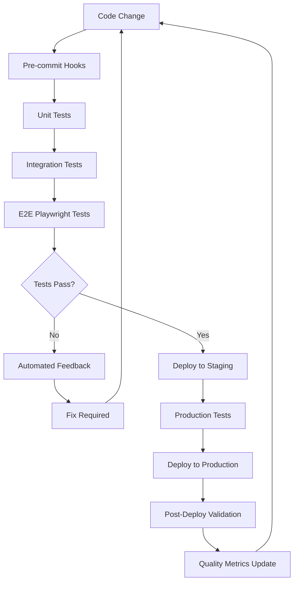

# PM33 Premium Testing Framework
## Closed-Loop Iterative Testing for World-Class Experience Delivery

### 🎯 Testing Philosophy
**"Every change is validated against premium standards before deployment"**

PM33 maintains world-class quality through rigorous automated testing that enforces:
- Premium UI/UX standards (glass morphism, animations, hover states)
- Marketing conversion optimization 
- Accessibility compliance (WCAG 2.1 AA)
- Cross-browser/device compatibility
- Performance benchmarks (Core Web Vitals)

### 🔄 Closed-Loop Workflow



### 📋 Test Categories & Standards

#### 1. Premium UI Compliance (`pm33-ui-compliance.spec.ts`)
```typescript
// MANDATORY: No commit without these passing
- Glass morphism implementation ✓
- Hover states on all interactive elements ✓  
- Premium animations (no basic spinners) ✓
- PM33 color system compliance ✓
- 8pt grid spacing system ✓
- Gradient usage validation ✓
```

#### 2. Marketing Design System (`marketing-design-compliance.spec.ts`)
```typescript
// Marketing pages use Mantine UI with clean design
- Marketing color tokens usage ✓
- Mantine component integration ✓
- NO glass morphism (clean marketing design) ✓
- Conversion-focused CTA styling ✓
- Professional typography hierarchy ✓
```

#### 3. Cross-Browser Compatibility
```typescript
// Test matrix: Chrome, Firefox, Safari, Mobile
- Desktop Chrome (primary) ✓
- Desktop Firefox ✓  
- Desktop Safari (WebKit) ✓
- Mobile Chrome (Pixel 5) ✓
- Mobile Safari (iPhone 12) ✓
```

#### 4. Performance Benchmarks
```typescript
// Core Web Vitals enforcement
- LCP (Largest Contentful Paint) < 2.5s ✓
- FID (First Input Delay) < 100ms ✓
- CLS (Cumulative Layout Shift) < 0.1 ✓
- Lighthouse Score > 95 ✓
```

#### 5. Accessibility Compliance
```typescript
// WCAG 2.1 AA compliance
- Keyboard navigation ✓
- Color contrast ratios ✓
- Screen reader compatibility ✓
- Semantic HTML structure ✓
- Aria labels and roles ✓
```

### 🚀 Implementation Phases

#### Phase 1: Foundation (Week 1)
1. **Fix Current Test Failures**
   - Resolve 404/500 API endpoint errors
   - Fix accessibility compliance issues
   - Stabilize development environment

2. **Pre-commit Hook Setup**
   ```bash
   npm install --save-dev husky lint-staged
   # Run critical tests before every commit
   ```

3. **Test Data & Mocking**
   - Create stable test data
   - Mock external API dependencies
   - Ensure consistent test environment

#### Phase 2: Automation (Week 2)
1. **CI/CD Integration**
   ```yaml
   # GitHub Actions workflow
   - Unit tests (Jest)
   - Integration tests (API)
   - E2E tests (Playwright)
   - Visual regression tests
   - Performance audits (Lighthouse CI)
   ```

2. **Automated Quality Gates**
   - Block PRs with failing tests
   - Require 95+ Lighthouse scores
   - Mandate accessibility compliance
   - Enforce premium UI standards

3. **Real-time Monitoring**
   - PostHog error tracking
   - Core Web Vitals monitoring
   - User experience metrics

#### Phase 3: Advanced Validation (Week 3)
1. **Visual Regression Testing**
   ```typescript
   // Automated screenshot comparisons
   await expect(page).toHaveScreenshot('homepage-hero.png');
   await expect(page).toHaveScreenshot('pricing-table.png');
   await expect(page).toHaveScreenshot('demo-interface.png');
   ```

2. **User Journey Testing**
   ```typescript
   // End-to-end conversion flows
   - Landing → Demo → Trial signup ✓
   - Pricing → Plan selection → Checkout ✓
   - Strategic Intelligence → Analysis → Results ✓
   ```

3. **Performance Load Testing**
   - Simulate concurrent users
   - Database query optimization
   - CDN cache validation

### 📊 Quality Metrics Dashboard

#### Development Metrics
```javascript
const qualityMetrics = {
  testCoverage: '>90%',
  passRate: '100%', // No deployment with failures
  buildTime: '<3 minutes',
  deploymentFrequency: 'Daily',
  leadTime: '<2 hours', // Change to production
  mttr: '<15 minutes' // Mean time to recovery
};
```

#### User Experience Metrics  
```javascript
const uxMetrics = {
  coreWebVitals: {
    lcp: '<2.5s',
    fid: '<100ms', 
    cls: '<0.1'
  },
  conversionRates: {
    landingToTrial: '>15%',
    trialToPaid: '>25%'
  },
  accessibility: {
    wcagCompliance: 'AA',
    lighthouseScore: '>95'
  }
};
```

### 🔧 Tools & Configuration

#### Test Runner Configuration
```typescript
// playwright.config.ts
export default defineConfig({
  testDir: './tests',
  fullyParallel: true,
  retries: process.env.CI ? 2 : 0,
  workers: process.env.CI ? 1 : 4,
  use: {
    baseURL: 'http://localhost:3005',
    trace: 'on-first-retry',
    screenshot: 'only-on-failure',
    video: 'retain-on-failure'
  },
  projects: [
    { name: 'chromium', use: { ...devices['Desktop Chrome'] } },
    { name: 'firefox', use: { ...devices['Desktop Firefox'] } },
    { name: 'webkit', use: { ...devices['Desktop Safari'] } },
    { name: 'mobile-chrome', use: { ...devices['Pixel 5'] } },
    { name: 'mobile-safari', use: { ...devices['iPhone 12'] } }
  ]
});
```

#### Package.json Scripts
```json
{
  "scripts": {
    "test:critical": "playwright test tests/pm33-ui-compliance.spec.ts",
    "test:marketing": "playwright test tests/marketing/",
    "test:accessibility": "playwright test tests/accessibility/",
    "test:performance": "playwright test tests/performance/", 
    "test:visual": "playwright test --update-snapshots",
    "test:all": "npm run test:critical && npm run test:marketing && npm run test:accessibility",
    "pre-commit": "npm run test:critical && npm run test:marketing",
    "ci:test": "npm run test:all && npm run test:performance"
  }
}
```

### 🎯 Success Criteria

#### Development Quality Gates
- [ ] **100% Critical Test Pass Rate** - No deployment without passing core tests
- [ ] **<3 Minute Build Time** - Fast feedback loops for developers  
- [ ] **95+ Lighthouse Score** - Performance and accessibility benchmarks
- [ ] **Zero Console Errors** - Clean development and production environments
- [ ] **Visual Consistency** - Screenshot tests prevent UI regressions

#### User Experience Benchmarks
- [ ] **<2.5s Page Load** - Core Web Vitals LCP compliance
- [ ] **Mobile-First Design** - Perfect mobile experience across devices
- [ ] **WCAG 2.1 AA** - Full accessibility compliance
- [ ] **15%+ Conversion Rate** - Landing to trial conversion optimization
- [ ] **Premium UI Standards** - Glass morphism, animations, hover states

### 🔄 Continuous Improvement

#### Weekly Quality Reviews
1. **Test Coverage Analysis** - Identify gaps in test coverage
2. **Performance Regression Review** - Monitor Core Web Vitals trends  
3. **User Feedback Integration** - Convert user issues to tests
4. **Competitive Benchmarking** - Maintain premium experience edge

#### Monthly Framework Evolution
1. **New Test Patterns** - Expand testing capabilities
2. **Tool Upgrades** - Keep testing tools current
3. **Best Practice Updates** - Incorporate industry standards
4. **Team Training** - Ensure testing expertise across team

---

**Implementation Timeline: 3 weeks to full premium testing framework**
**Success Metric: Zero quality regressions post-implementation**
**Outcome: World-class user experience delivery at PM33 velocity**