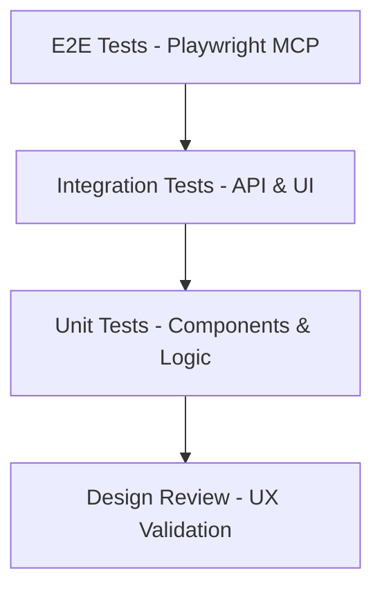

# PM33 Testing Documentation

> **Status**: Active Development | **Last Updated**: 2025-08-18 | **Version**: 1.0.0

## Overview

This document serves as the comprehensive testing guide for PM33, covering automated testing strategies, design review processes, and quality assurance workflows. It's continuously updated as we build and expand the platform.

## Table of Contents

- [Testing Strategy](#testing-strategy)
- [Design Review Workflow](#design-review-workflow)
- [Playwright MCP Integration](#playwright-mcp-integration)
- [Test Coverage](#test-coverage)
- [Quality Assurance Checklist](#quality-assurance-checklist)
- [Continuous Integration](#continuous-integration)
- [Performance Testing](#performance-testing)
- [Accessibility Testing](#accessibility-testing)

---

## Testing Strategy

### Core Testing Principles

1. **Live Environment First**: Always test interactive experiences over static analysis
2. **User-Centric Testing**: Focus on real user scenarios and pain points
3. **Design System Compliance**: Ensure all UI changes follow established design principles
4. **Accessibility by Default**: WCAG 2.1 AA compliance as minimum standard
5. **Performance Awareness**: Monitor and test for optimal loading and interaction times

### Testing Pyramid



---

## Design Review Workflow

### Playwright MCP Integration

The design review process leverages Playwright MCP for automated UI testing and validation:

#### Phase 0: Preparation
- [ ] Analyze PR description and changes
- [ ] Review code diff for implementation scope
- [ ] Set up live preview environment
- [ ] Configure viewport (1440x900 desktop)

#### Phase 1: Interaction Testing
- [ ] Execute primary user flows
- [ ] Test interactive states (hover, active, disabled)
- [ ] Verify destructive action confirmations
- [ ] Assess perceived performance

#### Phase 2: Responsiveness Testing
- [ ] Desktop (1440px) - capture screenshot
- [ ] Tablet (768px) - layout adaptation
- [ ] Mobile (375px) - touch optimization
- [ ] No horizontal scrolling verification

#### Phase 3: Visual Polish
- [ ] Layout alignment consistency
- [ ] Typography hierarchy validation
- [ ] Color palette consistency
- [ ] Visual hierarchy assessment

#### Phase 4: Accessibility (WCAG 2.1 AA)
- [ ] Complete keyboard navigation testing
- [ ] Visible focus states verification
- [ ] Keyboard operability confirmation
- [ ] Semantic HTML validation
- [ ] Form labels and associations
- [ ] Image alt text verification
- [ ] Color contrast ratios (4.5:1 minimum)

#### Phase 5: Robustness Testing
- [ ] Form validation with invalid inputs
- [ ] Content overflow scenarios
- [ ] Loading, empty, and error states
- [ ] Edge case handling

---

## Playwright MCP Integration

### Available Tools

Our Playwright MCP integration provides comprehensive browser automation:

```javascript
// Navigation
mcp__playwright__browser_navigate
mcp__playwright__browser_navigate_back
mcp__playwright__browser_navigate_forward

// Interaction
mcp__playwright__browser_click
mcp__playwright__browser_type
mcp__playwright__browser_hover
mcp__playwright__browser_drag
mcp__playwright__browser_select_option

// Validation
mcp__playwright__browser_take_screenshot
mcp__playwright__browser_snapshot
mcp__playwright__browser_console_messages
mcp__playwright__browser_evaluate

// Viewport Management
mcp__playwright__browser_resize
mcp__playwright__browser_install

// Tab Management
mcp__playwright__browser_tab_list
mcp__playwright__browser_tab_new
mcp__playwright__browser_tab_select
mcp__playwright__browser_tab_close
```

### Test Environment Setup

```bash
# Frontend Development Server
npm run dev  # http://localhost:3000

# Backend API Server  
cd app/backend && python3 -m uvicorn main:app --host 127.0.0.1 --port 8001 --reload

# Test URLs
- Homepage: http://localhost:3000/
- Command Center: http://localhost:3000/command-center
- Strategic Intelligence: http://localhost:3000/strategic-intelligence
- API Health: http://localhost:8001/
```

---

## Test Coverage

### Current Test Status

#### Frontend Components ✅ In Progress
- [x] Homepage - Mantine UI conversion completed
- [x] Strategic Intelligence Engine - Component implementation
- [x] Strategic Command Center V2 - Dashboard functionality
- [ ] Resource Allocation Optimizer - Pending implementation
- [ ] Competitive Intelligence Engine - Pending implementation
- [ ] Strategic Roadmap Intelligence - Pending implementation
- [ ] Strategic Execution Intelligence - Pending implementation

#### Backend APIs 🔄 Partial Coverage
- [x] FastAPI server setup and health checks
- [x] Basic API structure and CORS configuration
- [ ] Strategic workflow endpoints - In development
- [ ] Jira integration endpoints - Pending
- [ ] MDM sync endpoints - Pending
- [ ] Database integration - Pending

#### Integration Tests 🚧 Not Started
- [ ] Frontend-Backend API integration
- [ ] External service integrations (Jira, Analytics)
- [ ] Authentication flows
- [ ] Error handling and edge cases

---

## Quality Assurance Checklist

### Pre-Deployment Checklist

#### Design Compliance ✅
- [ ] Follows PM33 Design System Guide principles
- [ ] Uses Mantine UI components consistently
- [ ] Implements 8-point grid system
- [ ] Applies proper visual hierarchy
- [ ] Maintains color palette consistency

#### Functionality ✅
- [ ] All interactive elements respond correctly
- [ ] Form validation works as expected
- [ ] Error states display appropriately
- [ ] Loading states provide feedback
- [ ] Success states confirm actions

#### Performance ✅
- [ ] Page load times under 3 seconds
- [ ] Interactive elements respond within 100ms
- [ ] Images optimized and properly sized
- [ ] No unnecessary re-renders
- [ ] Console free of errors and warnings

#### Accessibility ✅
- [ ] WCAG 2.1 AA compliance verified
- [ ] Screen reader compatibility tested
- [ ] Keyboard navigation functional
- [ ] Color contrast ratios meet standards
- [ ] Focus indicators clearly visible

---

## Continuous Integration

### Automated Testing Pipeline

```yaml
# Proposed CI/CD Pipeline
name: PM33 Quality Assurance
on: [push, pull_request]

jobs:
  test:
    runs-on: ubuntu-latest
    steps:
      - name: Checkout code
        uses: actions/checkout@v3
      
      - name: Setup Node.js
        uses: actions/setup-node@v3
        with:
          node-version: '18'
      
      - name: Install dependencies
        run: npm install
      
      - name: Run unit tests
        run: npm test
      
      - name: Build application
        run: npm run build
      
      - name: Setup Python
        uses: actions/setup-python@v4
        with:
          python-version: '3.11'
      
      - name: Install Python dependencies
        run: pip install -r requirements.txt
      
      - name: Start backend server
        run: |
          cd app/backend
          python -m uvicorn main:app --host 0.0.0.0 --port 8001 &
      
      - name: Run Playwright tests
        run: |
          npx playwright install
          npx playwright test
      
      - name: Design review validation
        run: npm run design-review
```

---

## Performance Testing

### Core Web Vitals Targets

| Metric | Target | Current | Status |
|--------|--------|---------|--------|
| LCP (Largest Contentful Paint) | < 2.5s | TBD | 🔄 |
| FID (First Input Delay) | < 100ms | TBD | 🔄 |
| CLS (Cumulative Layout Shift) | < 0.1 | TBD | 🔄 |
| TTFB (Time to First Byte) | < 600ms | TBD | 🔄 |

### Performance Monitoring

```javascript
// Performance measurement implementation
const observer = new PerformanceObserver((list) => {
  for (const entry of list.getEntries()) {
    console.log(`${entry.name}: ${entry.startTime}`);
  }
});
observer.observe({ entryTypes: ['navigation', 'paint', 'largest-contentful-paint'] });
```

---

## Accessibility Testing

### WCAG 2.1 AA Compliance Matrix

| Category | Requirement | Implementation Status | Notes |
|----------|-------------|----------------------|-------|
| **Perceivable** | Color contrast 4.5:1 | ✅ Implemented | Mantine theme compliant |
| **Perceivable** | Text alternatives | 🔄 In Progress | Alt text for images |
| **Operable** | Keyboard accessible | ✅ Implemented | All interactive elements |
| **Operable** | Focus visible | ✅ Implemented | Mantine focus indicators |
| **Understandable** | Readable text | ✅ Implemented | Clear typography hierarchy |
| **Understandable** | Predictable navigation | ✅ Implemented | Consistent patterns |
| **Robust** | Valid HTML | ✅ Implemented | Semantic markup |
| **Robust** | Screen reader compatible | 🔄 Testing Required | Needs validation |

### Accessibility Testing Tools

```bash
# Automated accessibility testing
npm install @axe-core/playwright --save-dev

# Manual testing checklist
- Screen reader testing (NVDA, JAWS, VoiceOver)
- Keyboard-only navigation
- High contrast mode testing
- Zoom testing (up to 200%)
```

---

## Test Data and Scenarios

### User Personas for Testing

#### Primary Persona: Senior Product Manager
- **Name**: Sarah Chen
- **Context**: Series B startup, 6 years PM experience
- **Scenario**: Needs strategic guidance for quarterly roadmap planning
- **Key Flows**: Strategic Intelligence → Roadmap Intelligence → Task Generation

#### Secondary Persona: VP Product  
- **Name**: Marcus Rodriguez
- **Context**: Growth-stage company, managing 5 PMs
- **Scenario**: Resource allocation across multiple initiatives
- **Key Flows**: Command Center → Resource Allocation → Team Coordination

### Test Data Sets

```json
{
  "mockProjects": [
    {
      "id": "proj_001",
      "name": "AI-Powered Customer Portal",
      "status": "active",
      "progress": 75,
      "team": ["PM", "3 Engineers", "1 Designer"],
      "priority": "high",
      "dueDate": "2025-09-15"
    }
  ],
  "mockStrategicQueries": [
    "Our competitor launched a similar feature. How should we reprioritize our roadmap?",
    "We have budget for 3 engineers OR $150K marketing spend. Which drives faster revenue growth?",
    "Engineering velocity is 20% below target. How should we reallocate resources?"
  ]
}
```

---

## Issue Tracking and Resolution

### Bug Classification System

| Priority | Description | Response Time | Examples |
|----------|-------------|---------------|----------|
| **[Blocker]** | Critical failures | Immediate | App crashes, data loss |
| **[High-Priority]** | Significant issues | < 24 hours | Broken user flows |
| **[Medium-Priority]** | Improvements | < 1 week | UX enhancements |
| **[Nitpick]** | Minor aesthetic | Next sprint | Color adjustments |

### Current Known Issues

1. **[Resolved]** ✅ IconLightbulb import error in StrategicIntelligenceEngine
2. **[Resolved]** ✅ Homepage "laundry list" formatting issue
3. **[In Progress]** 🔄 Strategic workflow implementations
4. **[Pending]** ⏳ Jira API integration setup

---

## Future Testing Enhancements

### Planned Improvements

1. **Automated Visual Regression Testing**
   - Playwright screenshot comparison
   - Design system compliance checking
   - Cross-browser compatibility validation

2. **Performance Monitoring Dashboard**
   - Real-time performance metrics
   - User experience analytics
   - Core Web Vitals tracking

3. **A/B Testing Framework**
   - Feature flag management
   - Statistical significance tracking
   - User behavior analytics

4. **Load Testing**
   - API endpoint stress testing
   - Concurrent user simulation
   - Database performance under load

---

## Contributing to Testing

### How to Add Tests

1. **Component Tests**: Add to `/tests/components/`
2. **Integration Tests**: Add to `/tests/integration/`
3. **E2E Tests**: Add to `/tests/e2e/`
4. **Design Reviews**: Use `@agent-design-review` subagent

### Testing Standards

- All new features require corresponding tests
- Tests must be maintainable and focused
- Use descriptive test names and scenarios
- Include both happy path and edge cases
- Document test rationale and expected outcomes

---

## Resources and References

### External Resources
- [Playwright Documentation](https://playwright.dev/)
- [Mantine Testing Guide](https://mantine.dev/guides/testing/)
- [WCAG 2.1 Guidelines](https://www.w3.org/WAI/WCAG21/quickref/)
- [PM33 Design System Guide](/app/frontend/PM33_DESIGN_SYSTEM_GUIDE.md)

### Internal Documentation
- [PM33 Core Pain Points](/PM33_CORE_PAIN_POINTS.md)
- [Product Requirements Document](/PM33_PRODUCT_REQUIREMENTS_DOCUMENT.md)
- [Strategic Workflow Analysis](/PM33_DEEP_WORKFLOW_ANALYSIS.md)
- [Development Guide](/DEVELOPMENT-TESTING-GUIDE.md)

---

*This document is automatically updated as part of our continuous development process. Last updated: 2025-08-18*